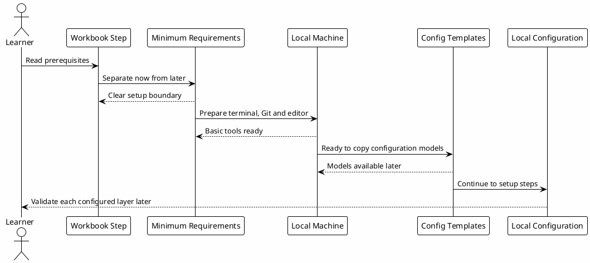

# 00 - Environment Prerequisites

## Em uma frase

Esta página separa o que a pessoa precisa ter agora do que será configurado passo a passo depois.

## O que você vai entender

Ao final desta página, você deve conseguir dizer: "posso iniciar o workbook com a base mínima e instalar o restante quando chegar na etapa correta".

## Resumo

Antes de configurar o ambiente, a pessoa precisa entender quais requisitos são necessários e quais são opcionais.

Esta etapa vem depois do setup de terminal e Codex CLI. O objetivo é deixar claro o que será necessário agora e o que será montado depois.

## Requisitos mínimos para começar

Para acompanhar a parte conceitual do workbook:

- navegador web;
- acesso ao repositório ou página do workbook;
- entendimento básico do que são terminal, arquivos e Git;
- disponibilidade para copiar arquivos de configuração nas etapas seguintes.

Depois da etapa de terminal, a base mínima esperada é:

- uma máquina local com terminal;
- Codex CLI instalado;
- Git instalado;
- Node.js e npm disponíveis apenas se a pessoa for rodar validações JavaScript ou o site localmente;
- um editor de texto;
- diretório `~/.codex` criado;
- acesso ao GitHub, caso a pessoa queira versionar a própria configuração depois;
- permissão para criar pastas e arquivos no diretório do usuário.

Nesta fase, a pessoa ainda não precisa ter hooks, PostgreSQL, Obsidian ou MCPs configurados.

Essas camadas serão montadas durante o workbook. Na fase `Local Configuration`, a pessoa vai copiar modelos de configuração, revisar os arquivos e validar cada parte em sequência.

## O que será instalado ou configurado depois

Ao longo do workbook, o ambiente completo passa a incluir:

| Item | Quando entra | Por que importa |
|---|---|---|
| Codex CLI | Antes de `config.toml` | Runtime principal onde configurações, skills, hooks e MCPs serão carregados. |
| Node.js e npm | Quando for rodar projetos JavaScript ou o site localmente | Permite executar comandos como `npm install`, `npm run build` e validações de frontend. Quem só está lendo o playbook publicado no navegador não precisa disso no começo. |
| Python 3 | Antes dos hooks | Scripts locais, hooks e automações auxiliares. |
| Obsidian ou vault Markdown | Na etapa de vault | Base local de documentos, memória e runbooks. |
| Hooks | Em `Local Configuration` | Guardrails e automações copiadas a partir dos modelos do workbook. |
| Skills | Em `Local Configuration` | Workflows reutilizáveis copiados ou instalados a partir dos modelos. |
| PostgreSQL | Na etapa de knowledge base | Base local para conhecimento indexado usada pelo MCP `local-le-vault`. |
| MCPs autenticados | Depois da base local | Conexão com vault, GitHub, Slack, Datadog ou outras fontes, conforme necessidade. |

## Ordem de aprendizagem

Esta jornada segue uma ordem parecida com um onboarding técnico:

| Bloco | O que a pessoa aprende | Resultado esperado |
|---|---|---|
| Fundamentos | Propósito, camadas e boundaries. | Sabe explicar o sistema antes de instalar tudo. |
| Setup | Terminal, Codex CLI e diretório local. | Consegue abrir o Codex e criar `~/.codex`. |
| Variáveis dos templates | Paths e comandos locais que serão aplicados nos downloads. | Consegue baixar templates já adaptados para a própria máquina. |
| Configuração | Rules, config, hooks, MCPs, agents e skills. | Consegue copiar templates e validar cada camada. |
| Hands-on | Testes pequenos por camada. | Sabe observar se a configuração refletiu no workflow. |
| Conhecimento | Vault, memória, PostgreSQL KB e reuso. | Entende como aprendizados viram gotchas e contexto futuro. |
| Playbook interativo | Site e checkpoints. | Entende que o site é a camada de leitura da jornada. |

## O que não deve ser feito ainda

Nesta etapa, evite:

- copiar hooks sem entender onde eles são registrados;
- criar arquivos de MCP com tokens reais;
- instalar PostgreSQL se você ainda está apenas estudando os conceitos;
- compartilhar qualquer template sem revisar dados privados;
- tentar validar skills antes de criar a estrutura `~/.codex/skills`.

Essas partes aparecem em páginas próprias para reduzir erro de ordem.

## Diagrama

Este diagrama representa o fluxo desta etapa: entender o mínimo necessário, preparar a base local e seguir para a fase onde os modelos serão copiados.

## Por que funciona

Separar requisitos de configuração evita fricção.

A pessoa entende primeiro:

- o que será instalado;
- por que cada dependência existe;
- qual base mínima é necessária para iniciar;
- quais partes serão copiadas ou configuradas depois;
- onde a configuração começa de fato.

## Checkpoint

Antes de seguir, confirme seu entendimento:

- você sabe quais requisitos são necessários apenas para ler o workbook;
- você sabe qual base mínima é necessária para iniciar a configuração local;
- você sabe que hooks, skills, MCPs, vault e PostgreSQL serão montados nas etapas seguintes;
- você sabe que os capítulos iniciais validam entendimento, não instalação;
- você sabe que validações de comandos aparecem apenas depois da etapa de configuração.

## Próximo Módulo

Siga para [[00-template-variables]].
