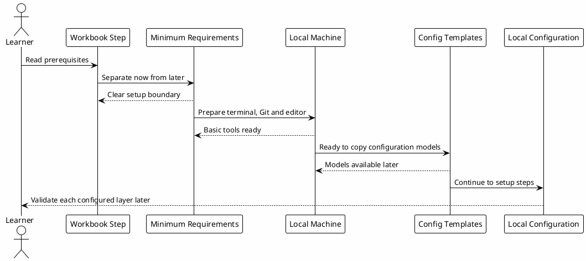

# 00 - Environment Prerequisites

## In One Sentence

This page separates what learners need now from what will be configured step by step later.

## What You Will Understand

By the end of this page, you should be able to say: "I can start the workbook with the minimum local base and install the rest when I reach the correct step."

## Summary

Before configuring the environment, learners need to understand which requirements are needed immediately and which ones are optional until later.

This step comes before local installation work. Its goal is to make the boundary clear: what is needed now, what will be copied later, and what should not be forced too early.

## Minimum Requirements to Start

To follow the conceptual part of the workbook:

- a web browser;
- access to the workbook repository or site;
- basic understanding of terminal, files and Git;
- willingness to copy configuration files in later steps.

When the next terminal step is complete, the expected minimum local base is:

- a local machine with a terminal;
- Codex CLI installed;
- Git installed;
- Node.js and npm only if the person will run JavaScript validations or the site locally;
- a text editor;
- the `~/.codex` directory created;
- GitHub access, if the person wants to version their own configuration later;
- permission to create folders and files in the user directory.

At this stage, the person does not need hooks, PostgreSQL, Obsidian or MCPs configured yet.

Those layers are built during the workbook. In `Local Configuration`, the person copies configuration models, reviews the files and validates each layer in sequence.

## What Will Be Installed Or Configured Later

| Item | When it appears | Why it matters |
|---|---|---|
| Codex CLI | Before `config.toml` | Main runtime where configuration, skills, hooks and MCPs are loaded. |
| Node.js and npm | When running JavaScript projects or the site locally | Enables commands like `npm install`, `npm run build` and frontend validation. People only reading the published playbook do not need this at the beginning. |
| Python 3 | Before hooks | Local scripts, hooks and helper automations. |
| Obsidian or Markdown vault | In the vault step | Local base for documents, memory and runbooks. |
| Hooks | In `Local Configuration` | Guardrails and automations copied from workbook templates. |
| Skills | In `Local Configuration` | Reusable workflows copied or installed from templates. |
| PostgreSQL | Optional local vault environment step | Local indexed knowledge base used only when `local-le-vault` is enabled. |
| Authenticated MCPs | After the local base | Connections to vault, GitHub, Slack, Datadog or other sources, as needed. |

## Learning Order

This journey follows a technical onboarding sequence:

| Block | What the learner learns | Expected result |
|---|---|---|
| Foundations | Purpose, layers and boundaries. | Can explain the system before installing everything. |
| Environment preparation | Terminal, Codex CLI, local directory and local vault backend. | Can open Codex and prepare the `local-le-vault` prerequisites. |
| Template variables | Local paths and commands applied to downloads. | Can download templates adapted to their machine. |
| Configuration | Rules, config, hooks, MCPs, subagents and skills. | Can copy templates and validate each layer. |
| Hands-on | Small tests per layer. | Can observe whether configuration affected the workflow. |
| Knowledge | Vault, memory, PostgreSQL KB and reuse. | Understands how learnings become gotchas and future context. |
| Guided first task | A safe first workflow. | Can observe the environment on real but low-risk work. |

## What Not to Do Yet

At this stage, avoid:

- copying hooks before understanding where they are registered;
- creating MCP files with real tokens;
- installing PostgreSQL before deciding whether local indexed knowledge is needed;
- sharing templates without reviewing private data;
- validating skills before creating the `~/.codex/skills` structure.

These parts have their own pages to reduce ordering mistakes.

## Diagram

This diagram shows this step: understand the minimum requirements, prepare the local base and continue to the phase where configuration models are copied.

## Why It Works

Separating prerequisites from configuration reduces friction.

The learner first understands:

- what will be installed;
- why each dependency exists;
- what minimum base is needed to start;
- which parts will be copied or configured later;
- where configuration actually begins.

## Checkpoint

Before moving on, confirm that:

- you know which requirements are needed only to read the workbook;
- you know the minimum base needed to start local configuration;
- you know hooks, skills, MCPs and optional knowledge services are built in later steps;
- you know the initial chapters validate understanding, not installation;
- you know command validation appears only after the configuration steps.

## Next Module

Go to [[00-terminal-and-codex-cli]].
