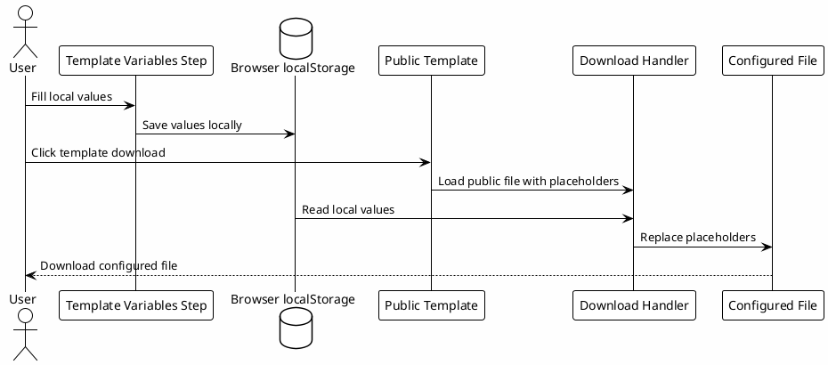

# 00.5 - Template Variables

## In One Sentence

This page prepares the local values that will be applied to downloaded templates during configuration.

## What You Will Understand

By the end of this page, you should be able to explain why public templates use placeholders and how the playbook generates a file ready for your machine.

## Summary

Configuration files should not contain personal paths, tokens or private details from one person.

The playbook therefore uses two layers:

- a public template with safe placeholders;
- local values filled in the browser by the person doing the setup.

When you download a template, the page replaces placeholders with the values from this step. The saved file is closer to what must be copied into `~/.codex`.

## How to Fill It In

Fill the card above before downloading `config.toml`, `copilot.config.toml`, rules, subagents, hooks, MCPs or skills.

If you skipped the optional local vault environment, keep vault, PostgreSQL and MCP server fields as placeholders until you decide to enable `local-le-vault`.

Use values that exist on your machine:

- `Codex home`: usually `~/.codex`;
- `Workspace`: directory where work repositories live;
- `Vault`: Markdown or Obsidian vault directory;
- `Datadog CLI`, `Vault MCP server` and `Atlassian MCP`: local command paths, when they exist;
- `PostgreSQL URL`: optional local connection used only by the `local-le-vault` knowledge base MCP;
- `Name`, `Team`, `Project` and `Stack`: values used in rules and subagents;
- `Install`, `Test`, `Lint`, `Build` and `Validation` commands: default project commands.

If a field does not exist on your machine yet, keep a generic placeholder and come back before downloading the template that depends on it.

For Windows users running WSL2, fill Linux paths from inside WSL. For example, use `/home/you/workspace/luxury-escapes` or `~/workspace/luxury-escapes`, not `C:\Users\you\...`.

## Where These Values Live

The values stay only in your browser `localStorage`.

They are not sent to a server, not committed to the repository and do not change public templates. They are only used at download time.

## Diagram

## Why It Works

It separates what is shareable from what is local.

The repository can publish useful models without exposing anyone's machine. At the same time, the learner does not need to manually replace every placeholder in every file.

## Checkpoint

Before moving on, confirm that:

- the public template remains generic;
- the values you fill in stay only in the browser;
- the download applies those values before saving the file;
- you reviewed paths before using any downloaded file;
- you did not place real tokens in fields that could be shared.

## Next Module

Go to [[05-config-toml]].
