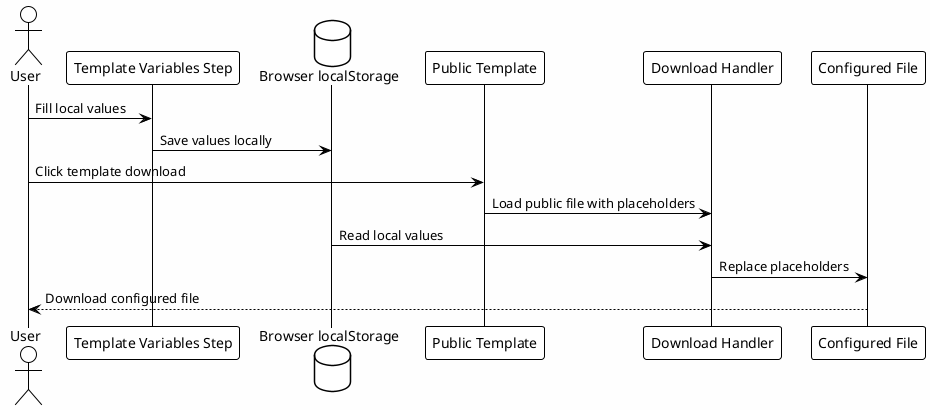

# 00.5 - Template Variables

## Em uma frase

Esta página prepara os valores locais que serão aplicados nos templates baixados durante a configuração.

## O que você vai entender

Ao final desta página, você deve conseguir explicar por que os templates públicos usam placeholders e como o playbook gera um arquivo pronto para a sua máquina.

## Resumo

Os arquivos de configuração não devem carregar paths pessoais, tokens ou detalhes privados de uma pessoa.

Por isso, o playbook usa duas camadas:

- template público, com placeholders seguros;
- valores locais, preenchidos no navegador de quem está fazendo o setup.

Quando você baixa um template, a página substitui os placeholders pelos valores preenchidos neste step. O arquivo salvo no seu computador já fica mais próximo do que precisa ser copiado para `~/.codex`.

## Como preencher

Preencha os campos do card acima antes de baixar `config.toml`, `copilot.config.toml`, rules, agents, hooks, MCPs ou skills.

Use valores que existem na sua máquina:

- `Codex home`: normalmente `~/.codex`;
- `Workspace`: diretório onde ficam os repositórios de trabalho;
- `Vault`: diretório do vault Markdown ou Obsidian;
- `Datadog CLI`, `Vault MCP server` e `Atlassian MCP`: paths dos comandos locais, quando existirem;
- `PostgreSQL URL`: conexão local usada pelo MCP de knowledge base;
- `Nome`, `Time`, `Projeto` e `Stack`: valores usados em rules e agentes;
- comandos de `Install`, `Test`, `Lint`, `Build` e `Validation`: comandos padrão do projeto.

Se algum campo ainda não existe na sua máquina, mantenha um placeholder genérico e volte nele quando chegar na etapa correspondente.

## Onde esses valores ficam

Os valores ficam apenas no `localStorage` do seu navegador.

Eles não são enviados para servidor, não são commitados no repositório e não alteram os templates públicos. Eles só são usados no momento do download.

## Diagrama

## Por que funciona

Funciona porque separa o que é compartilhável do que é local.

O repositório pode publicar modelos úteis sem expor a máquina de ninguém. Ao mesmo tempo, a pessoa que está fazendo o setup não precisa abrir cada template e substituir todos os placeholders manualmente.

## Checkpoint

Antes de seguir, confirme:

- você entende que o template público continua genérico;
- você entende que os valores preenchidos ficam apenas no navegador;
- você sabe que o download aplica esses valores antes de salvar o arquivo;
- você revisou os paths antes de usar qualquer arquivo baixado;
- você não colocou tokens reais em campos que serão compartilhados.

## Próximo Módulo

Siga para [[05-config-toml]].
