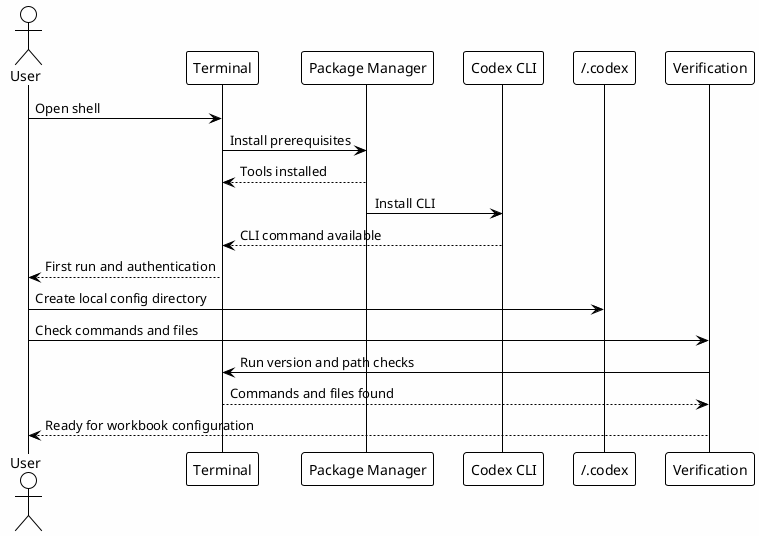

# 00 - Terminal and Codex CLI Setup

## Em uma frase

Esta etapa prepara a máquina para abrir o Codex e criar os arquivos locais que as próximas páginas vão preencher.

## O que você vai entender

Ao final desta página, você deve saber:

- qual terminal usar;
- por que Git aparece no setup e quando Node.js/npm realmente são necessários;
- como instalar e abrir o Codex CLI;
- onde fica o diretório `~/.codex`;
- quais ferramentas são obrigatórias e quais são apenas produtividade.

## Resumo

Antes de configurar rules, hooks, agents e skills, a pessoa precisa ter um terminal funcional e o Codex CLI instalado.

Esta etapa prepara a base mínima:

- terminal Unix-like;
- Git;
- Node.js e npm, quando houver projeto JavaScript, frontend ou validação do site local;
- Codex CLI;
- ferramentas de busca e validação;
- diretório `~/.codex`.

O material antigo do workshop de Claude usava a mesma ideia: primeiro preparar terminal e CLI, depois instalar ecossistema, depois validar. Aqui o fluxo foi adaptado para o Codex.

Para o onboarding da Luxury Escapes, a meta desta etapa é simples: todo participante deve conseguir abrir o terminal, rodar Codex e encontrar a pasta onde as próximas configurações serão colocadas.

Referência atual para instalação do Codex CLI: [OpenAI Codex CLI README](https://github.com/openai/codex#installing-and-running-codex-cli).

## Fluxo



## Passo 1 - Sistema operacional

macOS:

```bash
sw_vers
xcode-select --install
```

Windows:

```powershell
wsl --install
```

Depois de instalar WSL2, use Ubuntu/WSL para os comandos do workbook. O editor e o navegador podem continuar no Windows.

Linux:

```bash
uname -a
sudo apt update
sudo apt install -y build-essential curl wget git zsh jq unzip
```

## Passo 2 - Package manager

macOS:

```bash
brew --version
```

Se Homebrew não existir:

```bash
/bin/bash -c "$(curl -fsSL https://raw.githubusercontent.com/Homebrew/install/HEAD/install.sh)"
```

Ubuntu/WSL:

```bash
sudo apt update
sudo apt install -y curl file git
```

Homebrew no Linux/WSL é opcional. Use apenas se o time padronizar isso.

## Passo 3 - Node.js

O Codex pode ser instalado via script oficial, npm ou Homebrew. Mesmo assim, Node.js continua útil para projetos frontend e tooling local.

Instale NVM:

```bash
curl -o- https://raw.githubusercontent.com/nvm-sh/nvm/v0.40.3/install.sh | bash
source ~/.zshrc
nvm install 20
nvm use 20
```

Valide:

```bash
node --version
npm --version
```

## Passo 4 - Codex CLI

Instalação recomendada em macOS/Linux:

```bash
curl -fsSL https://chatgpt.com/codex/install.sh | sh
```

Windows PowerShell:

```powershell
powershell -ExecutionPolicy ByPass -c "irm https://chatgpt.com/codex/install.ps1 | iex"
```

Alternativas:

```bash
npm install -g @openai/codex
brew install --cask codex
```

Valide:

```bash
which codex
codex --version
```

Primeira execução:

```bash
codex
```

Siga o fluxo de autenticação mostrado no terminal.

## Passo 5 - Ferramentas recomendadas

Essas ferramentas não são todas obrigatórias, mas melhoram muito o workflow:

```bash
brew install ripgrep fd jq gh fzf bat eza git-delta zoxide
```

Ubuntu/WSL, versão mínima:

```bash
sudo apt update
sudo apt install -y ripgrep jq gh fzf
```

Valide:

```bash
git --version
rg --version
jq --version
gh --version
```

O mínimo para seguir é ter `codex`, `git`, `node` e `npm`. Ferramentas como `rg`, `jq`, `gh` e `fzf` ajudam no dia a dia, mas podem ser instaladas aos poucos.

## Passo 6 - Shell opcional

Se quiser padronizar aliases e helpers:

- [Download zshrc Codex template](templates/shell/zshrc.codex.template)

Aplicação manual:

```bash
$EDITOR ~/.zshrc
source ~/.zshrc
```

Use o template como referência. Não substitua seu `.zshrc` inteiro sem revisar.

## Passo 7 - Diretório Local Do Codex

Crie a base local:

```bash
mkdir -p ~/.codex
mkdir -p ~/.codex/agents ~/.codex/hooks ~/.codex/skills
```

Neste ponto ainda não precisa criar todos os arquivos. As próximas páginas entregam os templates.

## Script de verificação

- [Download verify-codex-setup.sh](templates/scripts/verify-codex-setup.sh)

Uso:

```bash
chmod +x verify-codex-setup.sh
./verify-codex-setup.sh
```

O script valida:

- `codex`;
- `git`;
- `node`;
- `npm`;
- ferramentas recomendadas;
- diretório `~/.codex`;
- primeiros arquivos de configuração, quando já existirem.

## Troubleshooting

| Sintoma | Verificação | Caminho |
|---|---|---|
| `codex: command not found` | `which codex` | Reinstale pelo script oficial ou revise `PATH`. |
| `node: command not found` | `node --version` | Instale NVM e rode `nvm install 20`. |
| npm global sem permissão | `npm config get prefix` | Prefira NVM ou instalador oficial do Codex. |
| browser de login não abriu no WSL | URL exibida no terminal | Copie a URL e abra manualmente no Windows. |
| icones quebrados no terminal | fonte do terminal | Use uma Nerd Font se usar temas com icones. |

## Erros comuns

- Tentar configurar hooks antes de confirmar que `codex --version` funciona.
- Copiar templates para uma pasta diferente de `~/.codex`.
- Usar Windows PowerShell para comandos que assumem Linux. No Windows, prefira WSL2.
- Substituir `.zshrc` inteiro por um template sem revisar aliases e variáveis existentes.

## Checkpoint

Antes de seguir, valide:

```bash
codex --version
git --version
node --version
npm --version
mkdir -p ~/.codex
test -d ~/.codex && echo "codex config dir ok"
```

Você deve conseguir explicar:

- como abrir o Codex CLI;
- onde fica a configuração local;
- quais ferramentas são obrigatórias;
- quais ferramentas são apenas produtividade;
- por que WSL2 é usado no Windows.

## Próximo Módulo

Siga para [[00-environment-prerequisites]].
