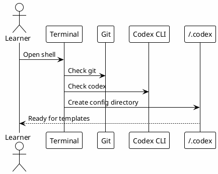

# 00 - Terminal And Codex CLI

## In One Sentence

This step prepares the terminal, Codex CLI and local configuration directory before advanced setup begins.

## What You Will Understand

By the end of this page, you should know how to confirm that the machine can run Codex and store local configuration files.

## Summary

Before copying hooks, skills or MCP configuration, the learner needs a working terminal and a local `~/.codex` directory.

This page does not require PostgreSQL, Obsidian, MCP authentication or hooks.

## Minimum Setup

Install or confirm:

- terminal access;
- Git;
- Codex CLI;
- Node.js and npm if you will run the site locally;
- Python 3 if you will use hook templates;
- a text editor.

Create the local Codex directory:

```bash
mkdir -p ~/.codex
```

## Suggested Checks

```bash
codex --version
 git --version
python3 --version
node --version
npm --version
test -d ~/.codex
```

If one of these commands fails, fix that base dependency before copying the advanced templates.

## Diagram



## Why It Works

The rest of the workbook assumes Codex can read local files and load configuration from `~/.codex`. Without that base, later errors are harder to diagnose.

## Checkpoint

Before moving on, confirm that:

- Codex CLI opens;
- `~/.codex` exists;
- you have a text editor;
- you understand that hooks and MCPs are configured later.

## Next Module

Go to [[00-environment-prerequisites]].
