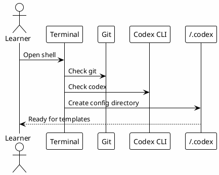
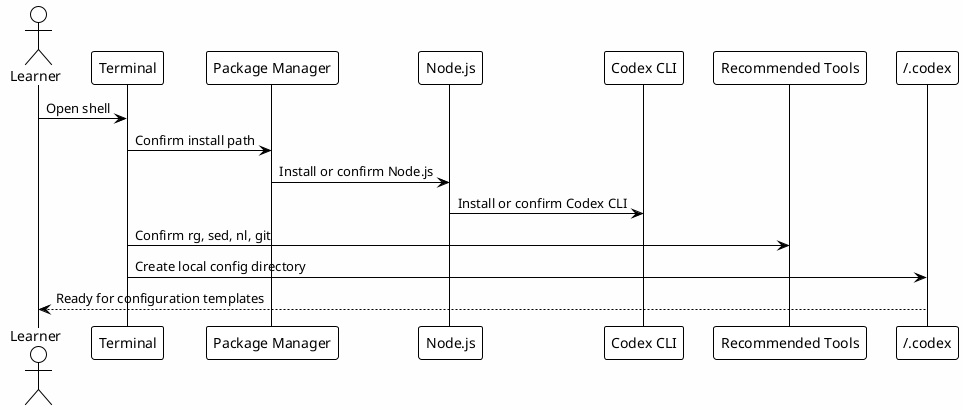

# 00 - Terminal And Codex CLI

## In One Sentence

This step prepares the terminal, Codex CLI and local configuration directory before advanced setup begins.

## What You Will Understand

By the end of this page, you should know how to confirm that the machine can run Codex and store local configuration files.

## Summary

Before copying hooks, skills or MCP configuration, the learner needs a working terminal and a local `~/.codex` directory.

This page does not require PostgreSQL, Obsidian, MCP authentication or hooks.

## Minimum Setup

Install or confirm:

- terminal access;
- Git;
- Codex CLI;
- Node.js and npm if you will run the site locally;
- Python 3 if you will use hook templates;
- a text editor.

Create the local Codex directory:

```bash
mkdir -p ~/.codex
```

## Suggested Checks

```bash
codex --version
git --version
python3 --version
node --version
npm --version
test -d ~/.codex
```

If one of these commands fails, fix that base dependency before copying the advanced templates.

## Diagram



## Why It Works

The rest of the workbook assumes Codex can read local files and load configuration from `~/.codex`. Without that base, later errors are harder to diagnose.

## Flow



## Step 1 - Operating System

This playbook assumes a developer machine with terminal access. On macOS, use Terminal, iTerm2 or another shell you already trust.

## Step 2 - Package Manager

Use the package manager that matches the machine. For macOS, Homebrew is usually the simplest path:

```bash
brew --version
```

If Homebrew is not installed, install it before continuing or use the package manager your team already supports.

## Step 3 - Node.js

Codex itself may not require Node.js for every action, but this playbook and many JavaScript projects do.

Recommended check:

```bash
node --version
npm --version
```

If a project has `.nvmrc`, prefer:

```bash
source ~/.nvm/nvm.sh
nvm use
```

## Step 4 - Codex CLI

Install or confirm Codex CLI using the official path available to your environment.

Validation:

```bash
codex --version
```

The important result is not the exact version number. The important result is that the `codex` command opens from your terminal.

## Step 5 - Recommended Tools

These tools make the workflow cheaper and easier to validate:

```bash
rg --version
sed --version || true
nl --version || true
git --version
python3 --version
```

Use `rg` and `rg --files` for search, and bounded reads like `sed -n` or `nl -ba` instead of dumping large files.

## Step 6 - Optional Shell Setup

If you use the shell template later, download it from the configuration pages and review it before applying. Do not blindly replace your shell config.

## Step 7 - Local Codex Directory

Create the directory that will hold rules, hooks, skills and MCP wrappers:

```bash
mkdir -p ~/.codex
mkdir -p ~/.codex/hooks ~/.codex/skills
```

## Verification Script

The templates include a setup verification script. After downloading it, run:

```bash
bash verify-codex-setup.sh
```

## Troubleshooting

| Symptom | Likely cause | Next step |
|---|---|---|
| `codex: command not found` | CLI is not installed or not on PATH. | Reinstall or fix shell PATH. |
| `node: command not found` | Node.js is missing. | Install Node or load `nvm`. |
| `rg: command not found` | ripgrep is missing. | Install `ripgrep`. |
| `~/.codex` missing | Local config directory was not created. | Run `mkdir -p ~/.codex`. |

## Common Mistakes

- Installing every MCP before Codex CLI works.
- Copying hooks before creating `~/.codex/hooks`.
- Running validation commands from the wrong directory.
- Ignoring PATH problems and assuming Codex is broken.

## Checkpoint

Before moving on, confirm that:

- Codex CLI opens;
- `~/.codex` exists;
- you have a text editor;
- you understand that hooks and MCPs are configured later.

## Next Module

Go to [[00-template-variables]].
