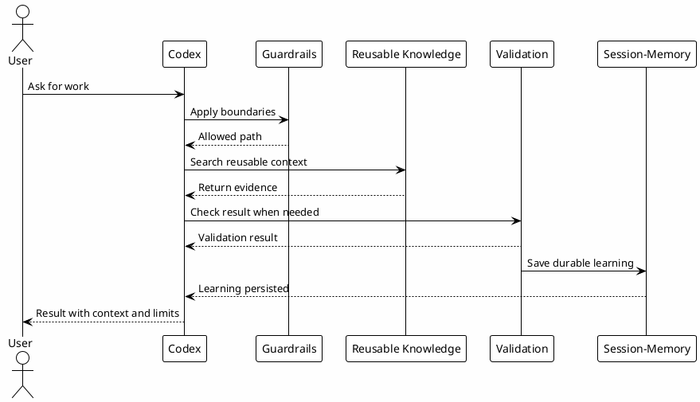

# 01 - Propósito

## Em uma frase

Este playbook ensina como transformar o Codex de um chat genérico em um operador local com contexto, regras, validação e memória.

Ele foi escrito para pessoas que estão entrando no workflow de IA aplicada à engenharia na Luxury Escapes.

## O que você vai entender

Ao final desta página, você deve conseguir responder:

- qual problema o ecossistema resolve;
- por que apenas conversar com uma IA não basta para trabalho técnico;
- por que contexto, guardrails, memória e validação ficam separados;
- por que conhecimento reutilizável reduz retrabalho.

## Antes de começar

Você não precisa ter Codex instalado para entender esta página. Aqui o foco é o mental model.

Pense no Codex como um colega técnico operando dentro da sua máquina. Para esse colega trabalhar bem, ele precisa saber onde estão as regras, quais ferramentas pode usar, quais limites não pode ultrapassar e onde procurar conhecimento já aprendido.

## Como este playbook foi organizado

A estrutura reaproveita uma ideia do workshop anterior de Claude Code, adaptada para o Codex:

1. entender o objetivo do ecossistema;
2. preparar terminal e runtime;
3. configurar rules, hooks, MCPs, agents e skills;
4. testar tudo em um hands-on pequeno;
5. entender como conhecimento vira memória, gotcha e contexto reutilizável.

O foco não é decorar nomes de arquivos. O foco é entender a função de cada camada e saber validar quando ela está funcionando.

## Resumo

Este ecossistema existe para transformar o Codex em um operador técnico local previsível, com contexto de trabalho, guardrails, memória e acesso a conhecimento reutilizável.

O objetivo não é apenas "usar uma IA para responder perguntas". O objetivo é criar um workflow onde cada sessão tenha:

- contexto certo antes da ação;
- evidência antes da conclusão;
- limites claros para efeitos externos;
- validação local quando houver mudança;
- memória durável quando uma decisão ou aprendizado precisa sobreviver.

## Diagrama

## Problema Resolvido

Sem esse ecossistema, cada interação com Codex tende a redescobrir o mesmo contexto: repos, tickets, regras, pitfalls, comandos, formato de commit, limites de Slack/Jira/GitHub e detalhes do vault.

Com o ecossistema:

- regras globais vivem em `~/.codex/config.toml`;
- instruções do projeto vivem em `AGENTS.md`;
- hooks injetam contexto e bloqueiam caminhos perigosos;
- skills tornam workflows repetíveis;
- agents permitem delegação limitada e barata;
- Session-Memory preserva continuidade;
- `local-le-vault` recupera conhecimento indexado no PostgreSQL;
- `rtk` reduz custo de tokens em comandos ruidosos.

## Conceitos-chave

| Conceito | Explicação simples |
|---|---|
| Contexto | Informação que o Codex precisa antes de agir, como regras do projeto, arquivos e histórico relevante. |
| Guardrails | Limites que evitam ações arriscadas, destrutivas ou externas sem aprovação. |
| Validação | Evidência de que uma mudança ou entendimento está correto. Pode ser teste, build, lint, leitura de arquivo ou checkpoint. |
| Memória | Registro durável para que uma decisão, pendência ou aprendizado sobreviva depois da conversa atual. |
| Conhecimento reutilizável | Conteúdo que pode ser encontrado de novo por skills, MCPs ou vault, como gotchas, runbooks e review learnings. |

## Exemplo simples

Sem workflow, uma pessoa desenvolvedora pode pedir: "me ajude a entender de onde veio este erro" ou "me ajude a melhorar o desempenho desta rotina". O Codex talvez encontre uma solução técnica plausível, mas sem contexto da empresa pode ignorar regras de negócio, histórico da implementação, pessoas envolvidas, tradeoffs anteriores e motivos pelos quais o código foi feito daquele jeito.

Com workflow, a sessão segue uma ordem melhor:

1. ler regras locais;
2. decidir qual skill, agent ou ferramenta deve ser usada para aquele tipo de pedido;
3. buscar no vault o contexto correto da vertical, serviço ou domínio envolvido, como Experiences, Hotéis, Pagamentos ou Ofertas;
4. editar somente o que faz parte do escopo;
5. validar;
6. registrar aprendizado durável se ele será útil depois.

## Por que funciona

Funciona porque separa responsabilidades.

O modelo não precisa lembrar tudo sozinho. Ele recebe uma combinação de:

- política estática;
- contexto dinâmico;
- ferramentas de busca;
- guardrails;
- memória;
- workflows nomeados.

Isso reduz improviso e aumenta repetibilidade.

## Limites

O ecossistema não deve:

- publicar conteúdo privado sem sanitização;
- executar efeitos externos sem aprovação quando exigido;
- substituir validação real;
- tratar memória antiga como verdade atual;
- transformar toda tarefa pequena em processo pesado.

## Erros comuns

- Achar que memória substitui validação. Memória ajuda, mas pode ficar desatualizada.
- Colar todo contexto no prompt. Isso aumenta ruído e custo. O ideal é buscar o contexto certo sob demanda.
- Colocar regra específica de um projeto em regra global. Isso espalha comportamento errado para outros repos.
- Configurar hooks e MCPs antes de entender o papel deles. Primeiro entenda a camada, depois copie o template.

## Checkpoint

Antes de seguir, valide apenas o entendimento do propósito.

Você deve conseguir explicar:

- por que o objetivo não é apenas "usar uma IA no chat";
- por que contexto, guardrails, memória e validação ficam separados;
- por que conhecimento reutilizável melhora sessões futuras;
- por que efeitos externos precisam de boundaries;
- por que a configuração prática vem depois do entendimento do sistema.

## Próximo módulo

Siga para [[02-ecosystem-layers]].
