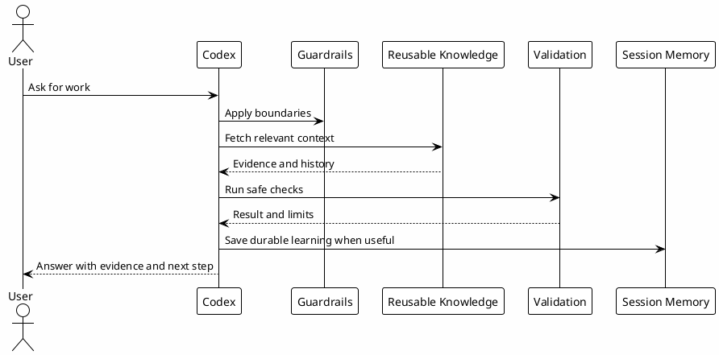

# 01 - Purpose

## In One Sentence

This playbook teaches how to turn Codex from a generic chat into a local operator with context, rules, validation and memory.

## What You Will Understand

By the end of this page, you should understand what problem the workflow solves and why it has more layers than a normal chat prompt.

## Summary

The goal is not to make Codex answer longer. The goal is to make work predictable.

Without a workflow, a developer might ask: "help me understand why this payment bug happens". A generic assistant can suggest fixes, but it may not know the business rules, previous tradeoffs, owner decisions, service boundaries or known gotchas.

The ecosystem solves that gap by giving Codex:

- the right context before action;
- guardrails before risky tools;
- reusable workflows through skills;
- bounded delegation through agents;
- indexed evidence through MCPs;
- durable memory for decisions and learnings;
- local validation before claiming success.

## How This Playbook Is Organized

The journey starts with concepts, then moves into local setup, then knowledge reuse.

You should not install everything at once. Each layer has a role and a checkpoint.

## Diagram



## Why It Works

The workflow separates responsibilities.

- Rules define expected behavior.
- Hooks enforce local guardrails.
- Skills encode repeatable workflows.
- Agents handle bounded delegation.
- MCPs fetch evidence.
- Vault and PostgreSQL preserve knowledge.
- Checkpoints prove understanding or setup.

That separation makes the system easier to inspect and safer to operate.

## Example

A weak request is:

```text
Fix this bug.
```

A better request is:

```text
Help me investigate why this bug happens. First identify the relevant service, read local context, check known gotchas, then propose the smallest safe validation.
```

The second request lets Codex use the environment as a workflow instead of guessing from a vague prompt.

## Checkpoint

Before moving on, confirm that you can explain:

- why context matters before code changes;
- why guardrails are separate from skills;
- why local validation matters;
- why learnings should become reusable knowledge;
- why not every task needs an agent.

## Next Module

Go to [[02-ecosystem-layers]].
