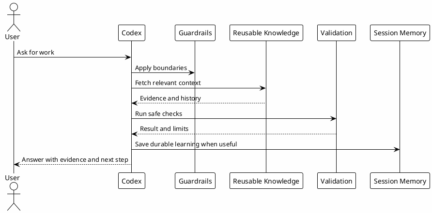

# 01 - Purpose

## In One Sentence

This playbook teaches how to turn Codex from a generic chat into a local operator with context, rules, validation and memory.

## What You Will Understand

By the end of this page, you should understand what problem the workflow solves and why it has more layers than a normal chat prompt.

## Summary

The goal is not to make Codex answer longer. The goal is to make work predictable.

Without a workflow, a developer might ask: "help me understand why this payment bug happens". A generic assistant can suggest fixes, but it may not know the business rules, previous tradeoffs, owner decisions, service boundaries or known gotchas.

The ecosystem solves that gap by giving Codex:

- the right context before action;
- guardrails before risky tools;
- reusable workflows through skills;
- bounded delegation through agents;
- indexed evidence through MCPs;
- durable memory for decisions and learnings;
- local validation before claiming success.

## How This Playbook Is Organized

The journey starts with concepts, then moves into local setup, then knowledge reuse.

You should not install everything at once. Each layer has a role and a checkpoint.

## Diagram



## Why It Works

The workflow separates responsibilities.

- Rules define expected behavior.
- Hooks enforce local guardrails.
- Skills encode repeatable workflows.
- Agents handle bounded delegation.
- MCPs fetch evidence.
- Vault and PostgreSQL preserve knowledge.
- Checkpoints prove understanding or setup.

That separation makes the system easier to inspect and safer to operate.

## Example

A weak request is:

```text
Fix this bug.
```

A better request is:

```text
Help me investigate why this bug happens. First identify the relevant service, read local context, check known gotchas, then propose the smallest safe validation.
```

The second request lets Codex use the environment as a workflow instead of guessing from a vague prompt.

## Before You Start

You do not need Codex installed to understand this page. The goal here is the mental model.

Think of Codex as a technical colleague operating inside your machine. For that colleague to work well, it needs to know where the rules live, which tools are allowed, which limits cannot be crossed and where existing knowledge should be searched.

## Problem Solved

Without this ecosystem, every Codex conversation tends to rediscover the same context: repositories, tickets, rules, pitfalls, commands, commit format, Slack/Jira/GitHub boundaries and vault details.

With the ecosystem:

- global rules live in `~/.codex/AGENTS.md` and runtime config;
- project instructions live in project `AGENTS.md`;
- hooks inject context and block dangerous paths;
- skills make workflows repeatable;
- agents allow bounded delegation;
- Session-Memory preserves continuity;
- `local-le-vault` retrieves indexed knowledge from PostgreSQL;
- `rtk` reduces token cost for noisy commands.

## Key Concepts

| Concept | Simple explanation |
|---|---|
| Context | Information Codex needs before acting, such as project rules, files and relevant history. |
| Guardrails | Limits that prevent risky, destructive or external actions without approval. |
| Validation | Evidence that a change or understanding is correct. It can be a test, build, lint, file read or checkpoint. |
| Memory | Durable record so a decision, pending item or learning survives the current conversation. |
| Reusable knowledge | Content that can be found again by skills, MCPs or the vault, such as gotchas, runbooks and review learnings. |

## Simple Example

Without workflow, a developer might ask: "help me understand where this error came from" or "help me improve the performance of this routine". Codex may find a plausible technical solution, but without company context it can miss business rules, implementation history, previous tradeoffs and why the code was written that way.

With workflow, the session follows a better order:

1. read local rules;
2. decide which skill, agent or tool applies to the request;
3. search the vault for the right vertical, service or domain context, such as Experiences, Hotels, Payments or Offers;
4. edit only what belongs to the scope;
5. validate;
6. save durable learning if it will be useful later.

## Limits

The ecosystem should not:

- publish private content without sanitization;
- execute external effects without approval when approval is required;
- replace real validation;
- treat old memory as current truth;
- turn every small task into a heavy process.

## Common Mistakes

- Thinking memory replaces validation. Memory helps, but it can become stale.
- Pasting all context into the prompt. That increases noise and cost. Search for the right context on demand.
- Putting project-specific rules into global rules. That spreads the wrong behavior to other repositories.
- Configuring hooks and MCPs before understanding their role. Understand the layer first, then copy the template.

## Checkpoint

Before moving on, confirm that you can explain:

- why context matters before code changes;
- why guardrails are separate from skills;
- why local validation matters;
- why learnings should become reusable knowledge;
- why not every task needs an agent.

## Next Module

Go to [[02-ecosystem-layers]].
