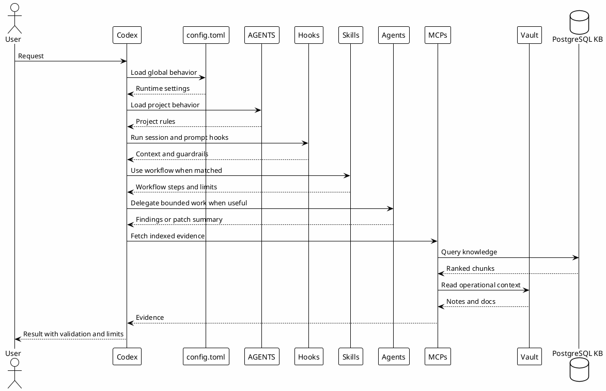

# 02 - Ecosystem Layers

## Em uma frase

O ecossistema funciona porque cada camada tem uma responsabilidade pequena e clara.

## O que você vai entender

Ao final desta página, você deve conseguir olhar para um comportamento do Codex e dizer onde ele deveria ser configurado: rules, hooks, skills, agents, MCPs, vault ou knowledge base.

## Resumo

O ecossistema é composto por camadas. Cada camada resolve uma parte do workflow e evita que tudo vire uma única instrução gigante.

Para iniciantes, a analogia é simples:

- rules dizem como o Codex deve se comportar;
- hooks automatizam avisos, bloqueios e registros;
- skills ensinam procedimentos repetíveis;
- agents ajudam a dividir trabalho quando existe paralelismo;
- MCPs conectam o Codex a fontes de dados;
- vault e PostgreSQL guardam conhecimento que pode voltar depois.

## Camadas

| Camada | Fonte | Papel |
|---|---|---|
| Global rules | `~/.codex/config.toml` | Define idioma, políticas, modelos, hooks, MCPs, plugins, sandbox e memória. |
| Project rules | `AGENTS.md` | Define regras do vault Obsidian e do trabalho Luxury Escapes. |
| RTK | `~/.codex/RTK.md` e binário `rtk` | Reduz output ruidoso e registra economia de tokens. |
| Hooks | `~/.codex/hooks/` | Injetam contexto, bloqueiam comandos perigosos e registram eventos. |
| Skills | `~/.codex/skills/*/SKILL.md` | Encapsulam workflows reutilizáveis. |
| Agents | `~/.codex/agents/*.toml` | Definem papéis delegáveis com custo e permissão controlados. |
| MCPs | `~/.codex/config.toml` | Conectam Codex a fontes externas ou indexadas. |
| Vault | `Luxury-Escapes/` | Fonte operacional de docs, dailies, runbooks e memória. |
| PostgreSQL KB | backend do `local-le-vault` | Armazena e recupera conhecimento reutilizável. |
| Playbook site | GitHub Pages | Interface interativa para ler a jornada, responder checkpoints e acompanhar progresso local. |

## Relação Entre Camadas

## Por que funciona

As camadas reduzem acoplamento.

Quando um comportamento muda, normalmente só uma camada precisa ser alterada:

- idioma e política: `config.toml`;
- contexto de projeto: `AGENTS.md`;
- bloqueio de comando: hook;
- workflow: skill;
- delegação: agent;
- conhecimento: vault ou PostgreSQL.

## Como decidir a camada correta

| Pergunta | Camada provável |
|---|---|
| É uma regra de comportamento que vale para toda conversa? | Global rules ou `config.toml`. |
| É uma regra específica de um repo ou vault? | `AGENTS.md` do projeto. |
| É uma proteção automática antes ou depois de comandos? | Hook. |
| É um passo a passo recorrente? | Skill. |
| É trabalho paralelo com escopo limitado? | Agent. |
| É uma fonte externa ou base indexada? | MCP. |
| É conhecimento escrito para ser lido e reutilizado? | Vault ou PostgreSQL KB. |

## Erros comuns

- Colocar tudo em `config.toml`. Esse arquivo deve configurar o runtime, não explicar todo processo.
- Criar skill para qualquer tarefa pequena. Skill vale quando o workflow se repete.
- Usar agent sem escopo claro. Delegação só ajuda quando a tarefa é limitada.
- Guardar segredo em template. Templates públicos mostram formato, não valores reais.

## Checkpoint

Antes de seguir, valide apenas o entendimento das camadas.

Você deve conseguir explicar:

- qual camada define regras globais;
- qual camada adiciona regras do projeto;
- qual camada bloqueia ou registra ações automaticamente;
- qual camada representa workflows reutilizáveis;
- qual camada guarda conhecimento durável;
- qual camada permite recuperar conhecimento indexado.

## Próximo Módulo

Siga para [[03-main-sequence]].
