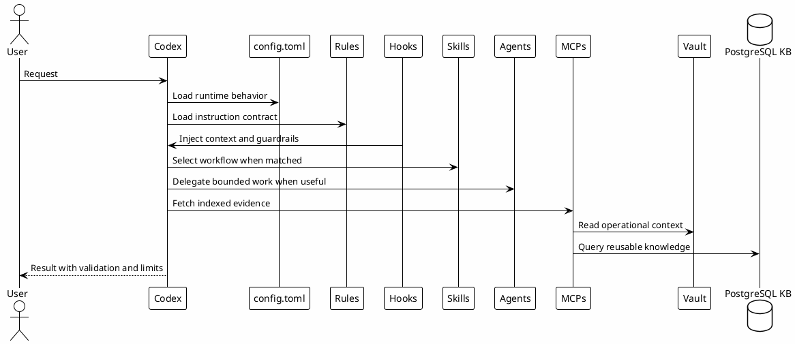

# 02 - Ecosystem Layers

## In One Sentence

The ecosystem is a set of layers that separate instructions, tools, memory, workflows and validation.

## What You Will Understand

By the end of this page, you should know which layer owns instructions, tools, memory and reusable knowledge.

## Summary

A reliable Codex setup is not one large prompt. It is a layered system.

Each layer has a job:

| Layer | Main role |
|---|---|
| `config.toml` | Runtime settings, MCPs, hooks, plugins and trusted projects. |
| Rules | Human instructions and operating boundaries. |
| Hooks | Local guardrails and automatic context injection. |
| Skills | Repeatable workflows. |
| Agents | Bounded delegation for specific roles. |
| MCPs | Access to external or indexed evidence. |
| Vault | Durable Markdown knowledge. |
| PostgreSQL KB | Indexed search base for reusable knowledge. |
| Playbook site | Guided reading and progress tracking. |

## Diagram

## Why It Works

Layers reduce coupling. When behavior changes, usually only one layer needs to change.

Examples:

- language and policy live in rules;
- hooks block or track tool use;
- skills define procedures;
- agents define roles;
- MCPs retrieve evidence;
- vault and PostgreSQL preserve knowledge.

## Layers

| Layer | Owns | Example |
|---|---|---|
| Runtime | Model, sandbox, approvals, hooks, MCP registration. | `config.toml` |
| Global rules | Personal operating rules and defaults. | `~/.codex/AGENTS.md` |
| Project rules | Repo-specific commands and boundaries. | project `AGENTS.md` |
| Hooks | Automatic context, tracking and guardrails. | `PreToolUse`, `SessionStart` |
| Skills | Repeatable workflows. | `study`, `feature-dev`, `investigation` |
| Agents | Bounded delegation. | researcher, reviewer, implementer |
| MCPs | External or indexed evidence. | vault, GitHub, Slack, Datadog |
| Vault / KB | Durable knowledge. | gotchas, runbooks, Session-Memory |

## Relationship Between Layers

A request does not hit every layer every time. A simple question might only use rules and local reads. A complex feature may use rules, hooks, a skill, MCP evidence, validation and memory.

## How to Choose the Right Layer

- If it is behavior that should always apply, use rules.
- If it protects tool execution, use a hook.
- If it repeats a workflow, use a skill.
- If it needs parallel bounded work, use an agent.
- If it needs external or indexed evidence, use an MCP.
- If it should survive the session, save it as memory or durable docs.

## Common Mistakes

- Putting everything into `config.toml`.
- Turning project-specific behavior into global behavior.
- Creating a skill for one-off work.
- Using agents for simple local reads.
- Treating MCP output as verified truth without checking context.

## Checkpoint

You should be able to identify which layer owns:

- global behavior;
- project behavior;
- command guardrails;
- reusable workflows;
- delegated roles;
- indexed knowledge.

## Next Module

Go to [[03-main-sequence]].
