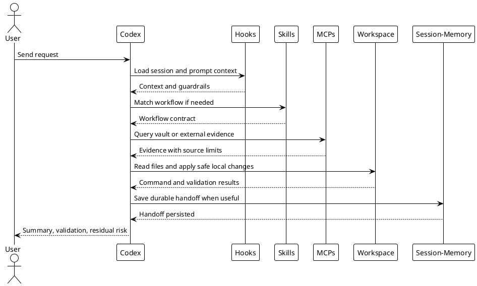

# 03 - Main Sequence

## Em uma frase

A sequência principal é a ordem segura de trabalho: entender, buscar evidência, agir, validar e registrar o que precisa sobreviver.

## O que você vai entender

Ao final desta página, você deve conseguir explicar o caminho normal de uma sessão Codex sem pular direto para implementação.

## Resumo

A sequência principal descreve o caminho normal de uma interação: o usuário pede algo, o Codex recebe contexto, escolhe workflow, busca evidência, executa localmente quando seguro, valida e registra memória quando necessário.

## Fluxo principal

## Etapas

1. Entrada do usuário.
2. Hooks adicionam contexto e bloqueiam caminhos conhecidos como perigosos.
3. O Codex identifica se uma skill se aplica.
4. Para trabalho LE, `local-le-vault` ou vault local vem antes de fonte.
5. Mudanças locais usam edições pequenas e validação focada.
6. Efeitos externos aguardam aprovação quando exigido.
7. Achados duráveis entram em Session-Memory.

## Exemplo guiado

Pedido: "revise essa configuração e melhore a documentação".

Fluxo esperado:

1. ler o plano ou handoff existente;
2. verificar a estrutura real do repo;
3. identificar quais páginas precisam de melhoria;
4. editar docs e UI dentro do escopo;
5. rodar build ou teste visual;
6. reportar o que mudou e o que ainda precisa de revisão humana.

O ponto importante: a ação vem depois de contexto suficiente, não antes.

## Por que funciona

A sequência evita dois problemas:

- agir sem contexto;
- acumular conhecimento apenas na conversa temporária.

O resultado de uma sessão pode alimentar a próxima.

## Erros comuns

- Confundir velocidade com pular contexto.
- Tratar toda pergunta como feature.
- Registrar memória para ruído temporário.
- Validar apenas visualmente quando houve mudança de build ou comportamento.

## Checkpoint

Antes de seguir, valide apenas o entendimento da sequência.

Você deve conseguir ordenar:

1. pedido do usuário;
2. contexto e regras entram na sessão;
3. skill ou workflow é escolhido quando necessário;
4. evidência é buscada antes de conclusão importante;
5. mudança local é validada quando existir;
6. efeito externo espera aprovação;
7. aprendizado durável vira memória ou conhecimento reutilizável.

## Próximo Módulo

Siga para [[04-workflow-boundaries]].
