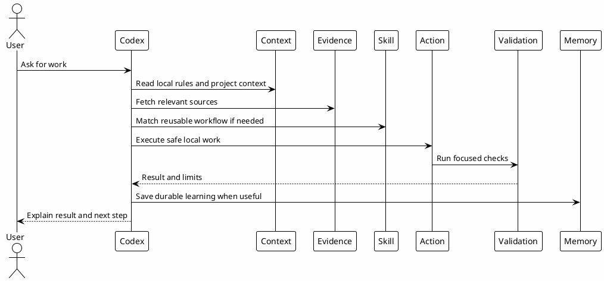

# 03 - Main Sequence

## In One Sentence

The main sequence is the normal path from request to context, evidence, action, validation and memory.

## What You Will Understand

By the end of this page, you should be able to order the workflow before and after a Codex action.

## Summary

A useful Codex session should not jump directly from request to edit.

The expected path is:

1. understand the request;
2. load local rules and project context;
3. query relevant evidence when needed;
4. select a skill or agent only when useful;
5. act locally within boundaries;
6. validate the result;
7. save durable learning only when it is worth reusing.

## Diagram

## Why It Works

This sequence prevents premature implementation. The assistant is forced to gather evidence before making claims and to validate before calling work complete.

## Checkpoint

Before moving on, confirm that you can explain why context and evidence come before implementation.

## Next Module

Go to [[04-workflow-boundaries]].
