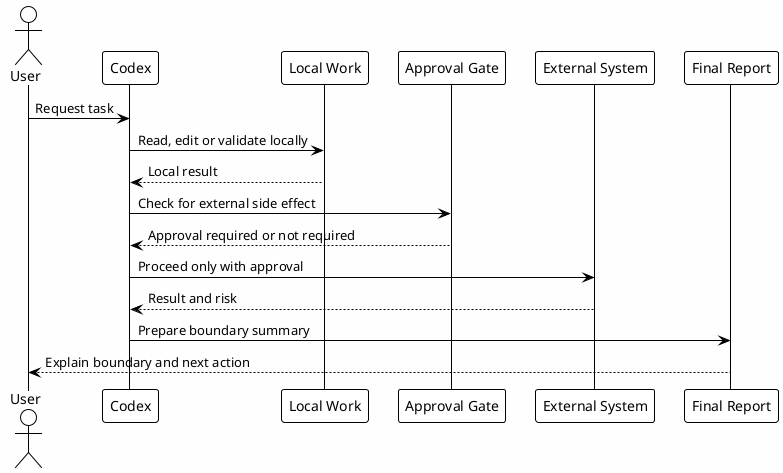

# 04 - Workflow Boundaries

## Em uma frase

Boundaries dizem até onde o Codex pode ir sozinho e quando precisa parar para pedir aprovação.

## O que você vai entender

Ao final desta página, você deve conseguir separar trabalho local seguro de ações que mudam estado fora da sua máquina.

## Resumo

Boundaries definem onde cada fluxo começa, quando deve terminar e quais ações exigem aprovação.

Sem boundaries, uma tarefa simples pode virar investigação pesada, ou uma investigação pode executar efeitos externos cedo demais.

## Fluxos

| Fluxo | Comeca quando | Termina quando |
|---|---|---|
| Direct answer | Pergunta simples e baixo risco. | Resposta clara com evidência ou incerteza explícita. |
| Documentation | Pedido de nota, workbook, ADR ou processo. | Markdown válido salvo no vault ou repo. |
| Feature | Pedido de implementação a partir de plano ou ticket. | Mudança local validada ou blocker concreto. |
| Investigation | Comportamento incerto, multi-fonte ou produção. | Findings, evidência e plano de ação. |
| Review | Pedido de review ou quality check. | Findings por severidade e gaps de teste. |
| Memory | Pedido de salvar/usar memória ou handoff útil. | Entry append-only em Session-Memory. |
| External action | Criar repo, PR, Slack, Jira, Confluence, CI/CD. | Executado somente após aprovação explícita. |

## Diagrama

## Regras de Aprovação

Pode seguir localmente:

- ler arquivos;
- editar docs locais;
- rodar validações locais;
- criar arquivos no workspace;
- consultar fontes read-only.

Precisa parar e pedir:

- criar repositório GitHub;
- push, PR ou commit quando não solicitado explicitamente;
- enviar Slack;
- alterar Jira ou Confluence;
- acessar ou modificar produção;
- mudar estratégia após falhas repetidas;
- executar operações destrutivas.

## Exemplos Práticos

| Pedido | Pode seguir localmente? | Por que |
|---|---|---|
| "Leia este arquivo e resuma." | Sim. | É leitura local. |
| "Edite esta página Markdown." | Sim. | É mudança local no workspace. |
| "Rode o build do site." | Sim. | É validação local. |
| "Crie um PR." | Apenas se foi pedido explicitamente. | Modifica estado no GitHub. |
| "Envie uma mensagem no Slack." | Precisa aprovação explícita. | É comunicação externa. |
| "Apague essa branch e resete tudo." | Precisa aprovação explícita e cuidado extra. | Pode destruir trabalho. |

## Por que funciona

Boundaries protegem o workflow de efeitos colaterais. Eles também deixam claro o que é progresso local seguro e o que muda estado fora da máquina.

## Erros comuns

- Achar que "commit" é sempre seguro. Commit muda histórico local e deve ser solicitado.
- Tratar read-only externo como mutação. Ler GitHub, Jira ou vault pode ser seguro, mas escrever neles exige aprovação.
- Continuar tentando uma estratégia quebrada sem avisar. Depois de falhas repetidas, a estratégia precisa ser revista.

## Checkpoint

Antes de seguir, valide apenas o entendimento dos limites.

Você deve conseguir separar:

- ações locais seguras;
- ações que modificam estado externo;
- ações destrutivas;
- ações que exigem aprovação explícita;
- situações em que uma tarefa simples precisa virar investigação.

## Próximo Módulo

Siga para [[05-config-toml]].
