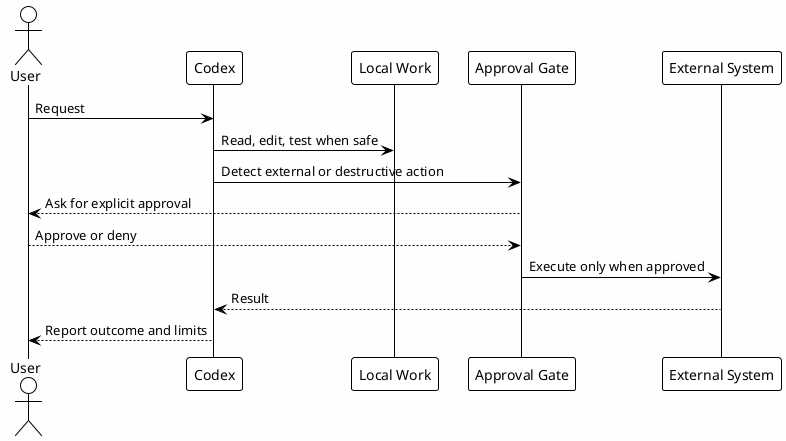

# 04 - Workflow Boundaries

## In One Sentence

Workflow boundaries separate safe local actions from external or destructive effects.

## What You Will Understand

By the end of this page, you should know which actions can proceed locally and which ones require explicit approval.

## Summary

Codex can read, inspect, build and validate locally. It should not silently mutate external systems.

Safe local actions usually include:

- reading files;
- running focused searches;
- running local builds or tests;
- editing files in the requested scope.

Actions that require explicit approval include:

- commit and push;
- opening PRs;
- sending Slack messages;
- modifying Jira or Confluence;
- destructive git commands;
- production, CI/CD, infrastructure or database mutations.

## Diagram

## Why It Works

Clear boundaries reduce accidental side effects. They let Codex move quickly locally while keeping external impact under human control.

## Approval Rules

Safe local actions usually do not need approval:

- reading files;
- searching with `rg`;
- running focused local tests;
- editing scoped local files when requested.

Explicit approval is required for:

- push or PR actions;
- Slack, Jira or Confluence writes;
- destructive file or Git operations;
- production, infrastructure or database mutations;
- secrets or credentials handling.

## Practical Examples

| Request | Boundary |
|---|---|
| "Read this README and explain the project" | Safe local read. |
| "Run the focused unit test" | Usually safe local validation. |
| "Push this branch" | External effect, needs approval. |
| "Post this in Slack" | External communication, needs approval. |
| "Delete this worktree" | Destructive local action, needs approval. |
| "Query production DB" | High-risk data access, needs explicit approval and safe mode. |

## Common Mistakes

- Treating GitHub, Slack or Jira writes as normal local actions.
- Running broad destructive commands because they are faster.
- Assuming a hook will catch every risky command.
- Forgetting that read-only and write actions have different risk.

## Checkpoint

You should be able to name at least three actions that require explicit approval.

## Next Module

Go to [[00-environment-prerequisites]].
