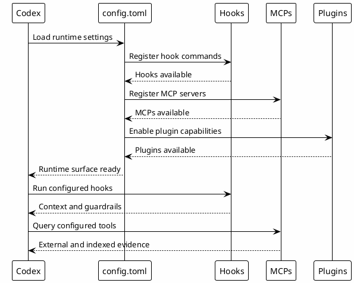

# 05 - config.toml

## Em uma frase

`config.toml` é o arquivo que diz ao runtime do Codex quais regras, hooks, MCPs e projetos confiáveis devem existir na máquina local.

## O que você vai entender

Ao final desta página, você deve conseguir:

- criar um `~/.codex/config.toml` mínimo;
- reconhecer seções principais do arquivo;
- diferenciar template público de configuração privada;
- saber que placeholders precisam ser substituidos;
- validar se hooks e MCPs foram registrados.

## Resumo

`~/.codex/config.toml` é a configuração principal do ambiente Codex.

Ele governa:

- instruções globais;
- modelo e reasoning;
- hooks;
- MCP servers;
- plugins;
- projetos confiáveis;
- memória;
- TUI;
- shell environment.

## Papel no Ecossistema

`config.toml` é a camada de runtime. Ele não deve virar documentação narrativa. Ele deve declarar comportamento que o Codex aplica automaticamente.

Exemplos de responsabilidades:

- idioma padrão em inglês e estilo de resposta;
- regras de commit;
- política de aprovação;
- roteamento para vault;
- lista de hooks ativos;
- lista de MCPs disponíveis;
- plugins instalados;
- status line da TUI.

## Passo a passo de configuração local

Nesta etapa a pessoa cria o primeiro arquivo real do ambiente local.

O objetivo não é copiar uma configuração privada completa. O objetivo é iniciar com um modelo seguro, preencher os valores do próprio ambiente e validar se as seções principais existem.

1. Preencha a página [[00-template-variables]] antes de baixar os templates.
2. Informe o `Codex home`, workspace, vault, comandos de validação e paths de MCPs que existem na sua máquina.
3. Baixe o template depois de preencher os campos.
4. Salve como `~/.codex/config.toml`.
5. Ative apenas hooks e MCPs que já existem na máquina.
6. Rode os comandos de checkpoint antes de avançar.

[Download config.toml template](templates/config.toml)

Antes de copiar, revise a regra principal: os valores digitados ficam apenas no seu navegador. O site usa esses valores para substituir placeholders no momento do download. O template publicado continua sem caminhos privados, tokens ou configuração pessoal completa.

```toml
# Codex local runtime template.
# Copy to: ~/.codex/config.toml
# Replace placeholders before using.

model = "gpt-5.5"
model_reasoning_effort = "low"
approval_policy = "on-request"
approvals_reviewer = "guardian_subagent"
sandbox_mode = "workspace-write"
service_tier = "standard"

[tui]
status_line = true

[features]
external_migration = true
goals = false
memories = true
prevent_idle_sleep = false
terminal_resize_reflow = true

[memories]
generate_memories = false
use_memories = true

[projects."YOUR_WORKSPACE_PATH"]
trust_level = "trusted"

[projects."YOUR_VAULT_PATH"]
trust_level = "trusted"

[mcp_servers.local-le-vault]
command = "ABSOLUTE/PATH/TO/.codex/hooks/mcp-local-le-vault-wrapper.sh"
args = []

[[hooks.PermissionRequest]]
matcher = ".*"

[[hooks.PermissionRequest.hooks]]
command = "python3 ABSOLUTE/PATH/TO/.codex/hooks/permission_request_log.py"

[[hooks.SessionStart]]
matcher = "startup|resume|clear"

[[hooks.SessionStart.hooks]]
command = "python3 ABSOLUTE/PATH/TO/.codex/hooks/session_start_context.py"

[[hooks.UserPromptSubmit]]
matcher = ".*"

[[hooks.UserPromptSubmit.hooks]]
command = "python3 ABSOLUTE/PATH/TO/.codex/hooks/user_prompt_context.py"

[[hooks.PreToolUse]]
matcher = ".*"

[[hooks.PreToolUse.hooks]]
command = "python3 ABSOLUTE/PATH/TO/.codex/hooks/pre_tool_use_guard.py"

[[hooks.PostToolUse]]
matcher = ".*"

[[hooks.PostToolUse.hooks]]
command = "python3 ABSOLUTE/PATH/TO/.codex/hooks/post_tool_use_tracker.py"

[[hooks.PostToolUse]]
matcher = "mcp__.*"

[[hooks.PostToolUse.hooks]]
command = "ABSOLUTE/PATH/TO/.codex/hooks/mcp-output-analytics.sh"

[[hooks.PreCompact]]
matcher = ".*"

[[hooks.PreCompact.hooks]]
command = "python3 ABSOLUTE/PATH/TO/.codex/hooks/precompact_backup.py"

[[hooks.PostCompact]]
matcher = ".*"

[[hooks.PostCompact.hooks]]
command = "python3 ABSOLUTE/PATH/TO/.codex/hooks/postcompact_log.py"

[[hooks.SessionEnd]]
matcher = ".*"

[[hooks.SessionEnd.hooks]]
command = "python3 ABSOLUTE/PATH/TO/.codex/hooks/session_end_save.py"
```

Comandos para aplicar o modelo:

```bash
mkdir -p ~/.codex
$EDITOR ~/.codex/config.toml
```

## Fluxo



## Por que funciona

Funciona porque fica antes da conversa. O modelo recebe regras e ferramentas configuradas sem depender do usuário repetir contexto.

## Como Ler O Arquivo Sem Se Perder

| Seção | Como pensar nela |
|---|---|
| `model` e `model_reasoning_effort` | Qual capacidade padrão o Codex usa. O modelo inicial usa `low` para manter custo e latência baixos, aumentando apenas quando a tarefa exigir. |
| `approval_policy` e `sandbox_mode` | Quais ações precisam de permissão e qual isolamento local existe. |
| `[features]` e `[memories]` | Habilitam comportamento do runtime, uso de memória e ergonomia da TUI. |
| `[projects]` | Pastas onde o Codex pode confiar no contexto local. |
| `[mcp_servers]` | Servidores que conectam Codex a fontes de conhecimento. |
| `[[hooks.*]]` | Scripts executados em momentos da sessão. |

## Erros comuns

- Deixar `ABSOLUTE/PATH/TO` sem substituir.
- Ativar hook que ainda não existe no disco.
- Colocar tokens no `config.toml` quando eles deveriam ficar em arquivo local de secrets.
- Publicar o arquivo real da máquina sem sanitizar.

## Conhecimento Produzido

`config.toml` não produz conhecimento por si mesmo. Ele habilita mecanismos que produzem conhecimento:

- hooks de tracking;
- Session-Memory;
- MCP output analytics;
- leitura de vault;
- plugin routing.

## Conhecimento Consumido

Consome instruções humanas e configuração local:

- regras convertidas;
- paths de hooks;
- paths de MCP wrappers;
- plugins e project trust.

## Checkpoints

```bash
rtk rg -n '^\\[mcp_servers|^\\[plugins|^\\[\\[hooks|^\\[projects|^\\[memories|^\\[tui' ~/.codex/config.toml
rtk sed -n '1,80p' ~/.codex/config.toml
rtk rg -n 'ABSOLUTE/PATH/TO|REPLACE_ME|TODO' ~/.codex/config.toml
```

Não publique o arquivo completo sem sanitizar. Ele pode conter paths internos e configuração operacional privada.

## Próximo Módulo

Siga para [[05-rules-and-instructions]].
