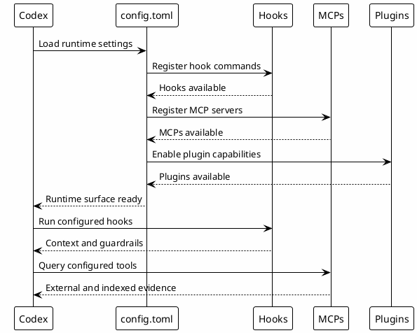

# 05 - config.toml

## In One Sentence

`config.toml` tells the Codex runtime which rules, hooks, MCPs, plugins and trusted projects exist on the local machine.

## What You Will Understand

By the end of this page, you should be able to create a minimum `~/.codex/config.toml`, recognize its main sections and validate that hooks and MCPs are registered.

## Summary

`~/.codex/config.toml` is the main runtime configuration file.

It governs:

- global instructions and behavior;
- model and reasoning defaults;
- hooks;
- MCP servers;
- plugins;
- trusted projects;
- memory;
- terminal behavior.

## Role In The Ecosystem

`config.toml` is the runtime layer. It should declare behavior that Codex applies automatically. It should not become a narrative document.

Examples of responsibilities:

- default language and style;
- approval policy;
- vault routing;
- active hooks;
- available MCPs;
- installed plugins;
- status line behavior.

## Local Configuration Steps

1. Fill in [[00-template-variables]] before downloading templates.
2. Provide `Codex home`, workspace, vault, validation commands and MCP paths that exist on your machine.
3. Download the template after filling the fields.
4. Save it as `~/.codex/config.toml`.
5. Enable only hooks and MCPs that exist locally.
6. Run the checkpoint commands before moving on.

[Download config.toml template](templates/config.toml)

The values typed into the page stay only in your browser. The site uses them to replace placeholders at download time. The published template remains free of private paths, tokens and personal configuration.

## Flow



## Why It Works

It runs before the conversation. Codex receives rules and tools without requiring the user to repeat the same context in every prompt.

## How to Read the File

| Section | How to think about it |
|---|---|
| `model` and `model_reasoning_effort` | Default model capacity and reasoning cost. |
| `approval_policy` and `sandbox_mode` | Which actions need permission and what local isolation exists. |
| `[features]` and `[memories]` | Runtime features, memory and TUI behavior. |
| `[projects]` | Directories trusted by Codex. |
| `[mcp_servers]` | Servers that connect Codex to evidence sources. |
| `[[hooks.*]]` | Scripts executed at specific session moments. |

## Common Mistakes

- Leaving `ABSOLUTE/PATH/TO` unchanged.
- Enabling a hook that does not exist on disk.
- Putting tokens in `config.toml` instead of local secrets.
- Publishing the real local file without sanitizing it.

## Knowledge Produced

`config.toml` does not produce knowledge by itself. It enables mechanisms that produce knowledge:

- tracking hooks;
- Session-Memory;
- MCP output analytics;
- vault reads;
- plugin routing.

## Knowledge Consumed

It consumes local configuration and human instructions:

- converted rules;
- hook paths;
- MCP wrapper paths;
- trusted project paths;
- plugin and runtime settings.

## Checkpoints

```bash
rtk rg -n '^\[mcp_servers|^\[plugins|^\[\[hooks|^\[projects|^\[memories|^\[tui' ~/.codex/config.toml
rtk sed -n '1,80p' ~/.codex/config.toml
rtk rg -n 'ABSOLUTE/PATH/TO|REPLACE_ME|TODO' ~/.codex/config.toml
```

Do not publish the complete file without sanitizing it. It may contain internal paths and private operational configuration.

## Next Module

Go to [[05-rules-and-instructions]].
