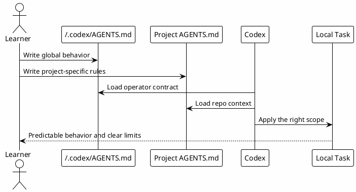

# 05.5 - Rules And Instructions

## In One Sentence

Rules are the written contract Codex loads before doing work.

## What You Will Understand

By the end of this page, you should be able to separate global rules, project rules and terminal operating rules.

## Summary

Rules are instruction files that define expected behavior before a task starts.

This setup uses two main levels:

- `~/.codex/AGENTS.md`: global local operator rules;
- project `AGENTS.md`: project-specific behavior and commands.

The shared model must not be a literal copy of one person's private setup. It should preserve principles and replace personal data with placeholders.

## Local Configuration Steps

1. Create or review `~/.codex/AGENTS.md`.
2. Download the templates below.
3. Keep global rules small and reusable.
4. Put project-specific rules in the project `AGENTS.md`.
5. Validate that public rules do not contain private paths, tokens or sensitive details.

- [Download global AGENTS.md template](templates/rules/AGENTS.md)
- [Download project AGENTS.md template](templates/rules/PROJECT_AGENTS.md)
- [Download RTK.md template](templates/rules/RTK.md)

```bash
mkdir -p ~/.codex
$EDITOR ~/.codex/AGENTS.md
cp PROJECT_AGENTS.md /path/to/your/project/AGENTS.md
$EDITOR /path/to/your/project/AGENTS.md
```

## Placeholder Map

| Placeholder | File | Meaning |
|---|---|---|
| `YOUR_NAME` | `~/.codex/AGENTS.md` | Person name. |
| `YOUR_ORG_OR_TEAM` | `~/.codex/AGENTS.md` | Team or organization. |
| `YOUR_WORKSPACE_PATH` | `~/.codex/AGENTS.md` | Repository workspace. |
| `YOUR_VAULT_PATH` | `~/.codex/AGENTS.md` | Vault or docs folder. |
| `YOUR_PROJECT_NAME` | project `AGENTS.md` | Repository or project name. |
| `YOUR_VALIDATION_COMMAND` | project `AGENTS.md` | Minimum validation command. |

## Flow



## How To Write A Good Rule

A good rule is:

- short enough to be remembered;
- specific enough to change behavior;
- reusable across tasks;
- verifiable when possible;
- clear about approval boundaries.

Avoid publishing:

- real tokens;
- private paths;
- internal customer or incident data;
- raw output from `.env`, `config.toml` or `.mcp-secrets`.

## What To Customize

Customize only values that belong to the learner's environment:

- name and team;
- workspace path;
- vault or docs path;
- project name;
- default validation command;
- project-specific boundaries.

Do not copy one person's private paths or internal machine details into public rules.

## Language

Recommended defaults for this playbook:

- Conversation: English.
- Code, commits and PR text: English.
- Keep project/domain names in their natural spelling.

## Operating Rules

Good operating rules should tell Codex:

- where to start reading;
- when to use vault or MCPs;
- when to ask for approval;
- how to validate work;
- how to report limits and remaining risk.

## What Not To Share

Do not publish:

- tokens;
- private paths;
- internal customer data;
- incident details that were not approved for sharing;
- raw `.env`, `.mcp-secrets` or private `config.toml` content.

## Common Mistakes

- Writing vague rules that do not change behavior.
- Mixing global and project-specific rules.
- Adding secrets to rules because they are convenient.
- Forgetting that public templates must use placeholders.

## Why It Works

Rules reduce repetition. Instead of explaining style, limits and preferences in every conversation, the runtime loads them as a local contract.

## Checkpoint

```bash
rtk sed -n '1,120p' ~/.codex/AGENTS.md
rtk sed -n '1,120p' ~/.codex/RTK.md
rtk rg -n 'token|secret|password|api_key|PRIVATE' ~/.codex/AGENTS.md ~/.codex/RTK.md
rtk rg -n 'YOUR_|REPLACE_ME|TODO' ~/.codex/AGENTS.md ~/.codex/RTK.md
```

Before moving on, you should be able to explain which rules are global, which are project-specific and why private paths do not belong in public templates.

## Next Module

Go to [[06-copilot-config]].
