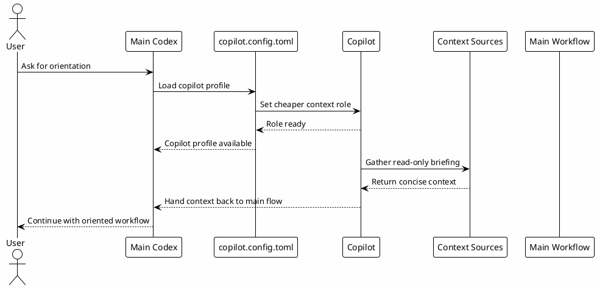

# 06 - copilot.config.toml

## Em uma frase

`copilot.config.toml` define um perfil auxiliar para orientação e contexto, separado do fluxo principal de execução.

## O que você vai entender

Ao final desta página, você deve conseguir explicar por que um perfil leve ajuda em briefing, mas não deve substituir implementação, review ou efeitos externos.

## Resumo

`~/.codex/copilot.config.toml` é uma configuração auxiliar para o papel de copilot.

Enquanto `config.toml` define o runtime completo, `copilot.config.toml` define um perfil de apoio pragmático para orientação, plano e contexto.

## Diagrama



## Papel no Ecossistema

O copilot serve para:

- orientação;
- briefing;
- recuperação de contexto;
- plano e tomada de decisão com baixo reasoning por padrão;
- suporte a decisões simples.

Ele não deve substituir os limites do fluxo principal. Mesmo com `workspace-write`, efeitos externos, commits, PRs e ações destrutivas continuam seguindo aprovação explícita.

## Passo a passo de configuração local

Nesta etapa a pessoa cria um perfil auxiliar igual ao ambiente de referência. Ele usa o mesmo modelo principal, mas mantém reasoning baixo por padrão e reasoning alto apenas em plan mode.

1. Confirme que `~/.codex/config.toml` já existe.
2. Baixe o template ou copie o bloco abaixo.
3. Salve como `~/.codex/copilot.config.toml`.
4. Mantenha `approval_policy = "on-request"` para preservar o gate de aprovação.
5. Use esse arquivo para orientação, contexto, plano e suporte operacional.
6. Valide que commits, PRs, Slack, Jira, Confluence e ações destrutivas continuam exigindo aprovação explícita pelas rules.

[Download copilot.config.toml template](templates/copilot.config.toml)

```toml
# Codex copilot profile template.
# Copy to: ~/.codex/copilot.config.toml
approval_policy = "on-request"
approvals_reviewer = "guardian_subagent"
model = "gpt-5.5"
model_reasoning_effort = "low"
personality = "pragmatic"
plan_mode_reasoning_effort = "high"
sandbox_mode = "workspace-write"
service_tier = "standard"

[features]
external_migration = true
goals = false
memories = true
prevent_idle_sleep = false
terminal_resize_reflow = true

[memories]
generate_memories = false
use_memories = true
```

Comandos para aplicar o modelo:

```bash
mkdir -p ~/.codex
$EDITOR ~/.codex/copilot.config.toml
```

## Diferença Para `config.toml`

| Item | `config.toml` | `copilot.config.toml` |
|---|---|---|
| Escopo | Runtime principal | Perfil auxiliar |
| Modelo | Modelo principal do runtime | Mesmo modelo do ambiente de referência |
| Reasoning | Baixo por padrão, aumentando apenas quando necessário | Baixo por padrão e alto em plan mode |
| Objetivo | Operar o workflow completo | Orientar, planejar e apoiar o fluxo |
| Mutações | Pode operar localmente conforme regras | Pode escrever no workspace, mas segue approval gate e rules |

## Por que funciona

Funciona porque separa orientação de execução.

Nem toda pergunta precisa do mesmo esforço de raciocínio. O perfil mantém `model_reasoning_effort = "low"` para o dia a dia e usa `plan_mode_reasoning_effort = "high"` quando a pessoa entra em modo de planejamento.

## Erros comuns

- Usar o perfil copilot para contornar approval gate.
- Achar que `workspace-write` permite commit, push, PR ou Slack sem pedido explícito.
- Confundir `copilot.config.toml` com o `config.toml` principal.
- Esperar que o perfil leve tome decisões de arquitetura sem a sessão principal revisar.

## Checkpoint

Valide o entendimento antes de abrir arquivos locais:

- o copilot é um perfil auxiliar;
- ele serve para briefing, contexto, plano e suporte operacional;
- ele usa `gpt-5.5` com reasoning baixo por padrão;
- ele não substitui o runtime principal;
- ele continua respeitando approval gate, rules e boundaries.

Quando o ambiente já estiver instalado, valide a configuração:

```bash
rtk sed -n '1,120p' ~/.codex/copilot.config.toml
rtk sed -n '1,120p' ~/.codex/agents/copilot.toml
rtk rg -n 'model|model_reasoning_effort|plan_mode_reasoning_effort|approval_policy|sandbox_mode|memories' ~/.codex/copilot.config.toml
```

Verifique se:

- `model = "gpt-5.5"`;
- `model_reasoning_effort = "low"`;
- `plan_mode_reasoning_effort = "high"`;
- `approval_policy = "on-request"`;
- `memories.use_memories = true`.

## Próximo Módulo

Siga para [[07-agents]].
