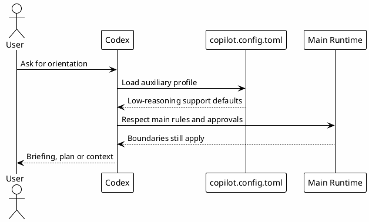

# 06 - copilot.config.toml

## In One Sentence

`copilot.config.toml` defines an auxiliary profile for orientation and context, separate from the main execution flow.

## What You Will Understand

By the end of this page, you should understand why a lightweight profile helps with briefing, but does not replace implementation, review or external action boundaries.

## Summary

`~/.codex/copilot.config.toml` is an auxiliary copilot profile.

While `config.toml` defines the full runtime, `copilot.config.toml` defines a pragmatic support profile for orientation, planning and context.

## Flow



## Local Configuration Steps

1. Confirm `~/.codex/config.toml` already exists.
2. Download the template or copy the file.
3. Save it as `~/.codex/copilot.config.toml`.
4. Keep `approval_policy = "on-request"`.
5. Use this file for orientation, context, planning and operational support.
6. Validate that commits, PRs, Slack, Jira, Confluence and destructive actions still require explicit approval by rules.

[Download copilot.config.toml template](templates/copilot.config.toml)

```bash
mkdir -p ~/.codex
$EDITOR ~/.codex/copilot.config.toml
```

## Difference From `config.toml`

| Item | `config.toml` | `copilot.config.toml` |
|---|---|---|
| Scope | Full runtime | Auxiliary profile |
| Model | Runtime default | Same reference model |
| Reasoning | Low by default, increased when needed | Low by default, high in plan mode |
| Mutations | Local work according to rules | Workspace write, but approval gates still apply |

## Why It Works

Not every question needs the same reasoning effort. The profile keeps `model_reasoning_effort = "low"` for daily support and uses `plan_mode_reasoning_effort = "high"` when planning is needed.

## Role in the Ecosystem

`copilot.config.toml` is auxiliary configuration. It can define cheaper read-only behavior, context collection or helper defaults without replacing the main runtime contract.

## Common Mistakes

- Treating `copilot.config.toml` as the source of all behavior.
- Duplicating secrets from `config.toml`.
- Forgetting to keep model and reasoning defaults cost-aware.
- Publishing private paths in a template.

## Checkpoint

```bash
rtk sed -n '1,120p' ~/.codex/copilot.config.toml
rtk rg -n 'model|model_reasoning_effort|plan_mode_reasoning_effort|approval_policy|sandbox_mode|memories' ~/.codex/copilot.config.toml
```

You should be able to explain that this is an auxiliary profile, not a bypass around the main runtime or approval model.

## Next Module

Go to [[07-agents|Subagents]].
