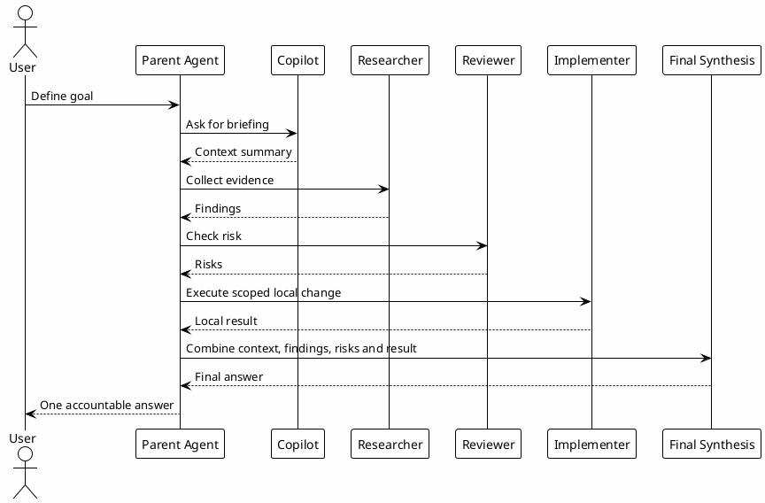

# 07 - Agents

## Em uma frase

Agents são papéis auxiliares para dividir trabalho limitado, sem perder o controle da sessão principal.

## O que você vai entender

Ao final desta página, você deve conseguir explicar quando vale delegar uma parte do trabalho e quando é melhor o Codex principal continuar sozinho.

## Resumo

Agents são papéis delegáveis definidos em `~/.codex/agents/*.toml`.

Eles existem para separar tipos de trabalho:

- `copilot`: contexto e briefing;
- `researcher`: pesquisa read-only;
- `reviewer`: review read-only;
- `implementer`: mudanças locais com escopo claro.

## Diagrama



## Papel no Ecossistema

Agents ajudam quando há paralelismo real ou quando um papel precisa de limites próprios.

Eles não devem ser usados automaticamente para tudo. Delegação duplica contexto e pode aumentar custo.

## Como Funcionam

Cada arquivo define:

- `name`;
- `description`;
- `sandbox_mode`;
- `model`;
- `model_reasoning_effort`;
- instruções do papel.

## Quando usar e quando evitar

Use agent quando:

- existem leituras independentes;
- a pergunta tem escopo claro;
- o resultado esperado cabe em um resumo curto;
- a sessão principal precisa comparar achados.

Evite agent quando:

- a tarefa é simples;
- o escopo está ambíguo;
- a mudança exige decisão de arquitetura;
- o custo de coordenar é maior que o trabalho.

## Passo a passo de configuração local

Nesta etapa a pessoa cria os papéis delegáveis usados pelo runtime.

1. Crie o diretório `~/.codex/agents`.
2. Baixe os templates ou copie os arquivos.
3. Salve cada arquivo com o mesmo nome em `~/.codex/agents/`.
4. Mantenha `copilot`, `researcher` e `reviewer` como `read-only`.
5. Use `implementer` apenas para mudanças locais com escopo claro.
6. Valide que nenhum agent tem permissão para commit, push, PR ou efeito externo sem aprovação.

Templates:

- [Download copilot.toml](templates/agents/copilot.toml)
- [Download researcher.toml](templates/agents/researcher.toml)
- [Download reviewer.toml](templates/agents/reviewer.toml)
- [Download implementer.toml](templates/agents/implementer.toml)

Comandos para aplicar:

```bash
mkdir -p ~/.codex/agents
$EDITOR ~/.codex/agents/copilot.toml
$EDITOR ~/.codex/agents/researcher.toml
$EDITOR ~/.codex/agents/reviewer.toml
$EDITOR ~/.codex/agents/implementer.toml
```

Modelo mínimo de agent:

```toml
name = "researcher"
description = "Read-only researcher for tracing files, patterns and prior context."
sandbox_mode = "read-only"
model = "gpt-5.4-mini"
model_reasoning_effort = "low"
language = "English"

developer_instructions = """
Collect evidence without modifying files.
Return concise findings with file:line references.
"""
```

## Regras Práticas

| Agent | Quando usar | Limite |
|---|---|---|
| `copilot` | Briefing, status, orientação. | Não modifica arquivos. |
| `researcher` | Coleta de evidência local/vault. | Não decide sozinho. |
| `reviewer` | Findings de qualidade e risco. | Não edita código. |
| `implementer` | Mudança escopada após plano claro. | Não cria PR, commit ou efeito externo. |

## Por que funciona

Funciona porque cada agent tem custo, permissão e foco diferentes.

O parent agent mantém a síntese final. Agents coletam ou executam fatias limitadas.

## Erros comuns

- Delegar sem pergunta objetiva.
- Pedir para agent editar muitos arquivos sem limite.
- Tratar resultado de agent como verdade sem revisar.
- Usar agents para substituir contexto local ou validação.

## Checkpoint

```bash
rtk proxy find ~/.codex/agents -maxdepth 1 -type f -name '*.toml' -print
rtk sed -n '1,80p' ~/.codex/agents/researcher.toml
rtk rg -n 'sandbox_mode|model_reasoning_effort|commit|push|pull request|external' ~/.codex/agents
```

Valide:

- agents read-only estão em `sandbox_mode = "read-only"`;
- implementer tem escopo claro;
- modelos seguem tiers de custo;
- nenhuma instrução permite efeito externo sem aprovação.

## Próximo Módulo

Siga para [[08-hooks]].
