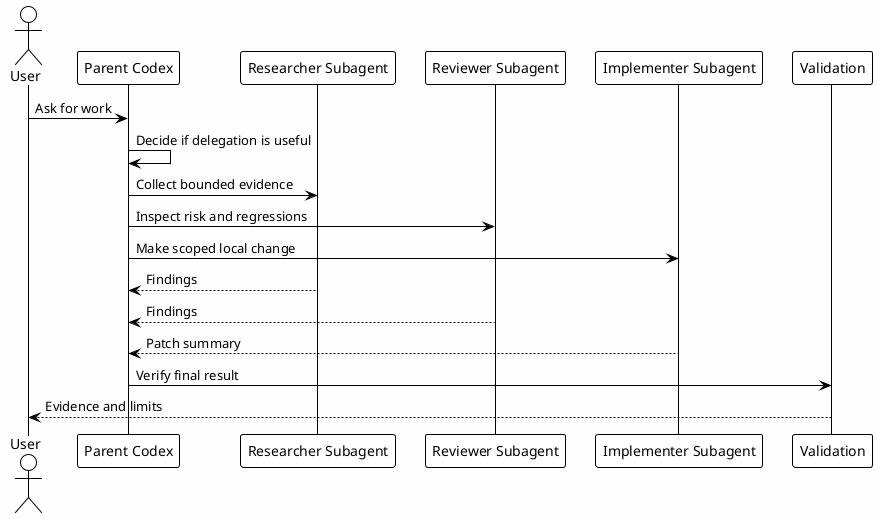

# 07 - Subagents

## In One Sentence

Subagents are role definitions used for bounded delegation, not a replacement for the parent Codex session's judgment.

## What You Will Understand

By the end of this page, you should know when to delegate to a subagent and when a simple local read is enough.

## Summary

Subagents help when work can be split into clear, bounded responsibilities.

Use subagents for:

- read-only research slices;
- independent review lanes;
- scoped implementation after a plan exists;
- parallel evidence collection.

Do not use subagents for every small question. The parent Codex session remains responsible for final synthesis, decisions and user communication.

## Flow



## Local Configuration Steps

1. Create `~/.codex/agents`.
2. Download the templates.
3. Keep roles narrow and explicit.
4. Use cheaper read-only tiers for research and review.
5. Use implementer only for scoped local changes.

Codex stores these role files under `~/.codex/agents`, but the behavior is best understood as subagent delegation from the parent session.

- [Download copilot.toml](templates/agents/copilot.toml)
- [Download researcher.toml](templates/agents/researcher.toml)
- [Download reviewer.toml](templates/agents/reviewer.toml)
- [Download implementer.toml](templates/agents/implementer.toml)

```bash
mkdir -p ~/.codex/agents
```

## Why It Works

Delegation works when the task has clear ownership and a small surface area. It fails when subagents are asked to make broad decisions without enough context.

## Role in the Ecosystem

Subagents are useful when the work can be split into bounded tasks with clear ownership. They are not a replacement for the main plan.

## How They Work

A parent session owns the goal. A subagent receives a specific job, gathers or changes only the scoped area, and reports back. The parent session decides what to trust and how to synthesize it.

## When to Use and When to Avoid

Use subagents for:

- parallel evidence collection;
- focused review slices;
- bounded implementation with clear files;
- independent checks that do not need shared mutable state.

Avoid subagents for:

- simple questions;
- tiny local reads;
- unclear requirements;
- work where two subagents might edit the same files.

## Practical Rules

- Give each subagent a concrete scope.
- Prefer read-only subagents for investigation.
- Keep final synthesis in the parent session.
- Do not use subagents to bypass approval boundaries.

## Common Mistakes

- Delegating before understanding the problem.
- Asking multiple subagents to touch the same files.
- Trusting subagent output without parent verification.
- Using expensive subagents for cheap context reads.

## Checkpoint

```bash
rtk proxy find ~/.codex/agents -maxdepth 1 -type f -name '*.toml' -print
rtk sed -n '1,80p' ~/.codex/agents/researcher.toml
```

You should be able to explain when to use `researcher`, `reviewer` and `implementer`.

## Next Module

Go to [[08-hooks]].
