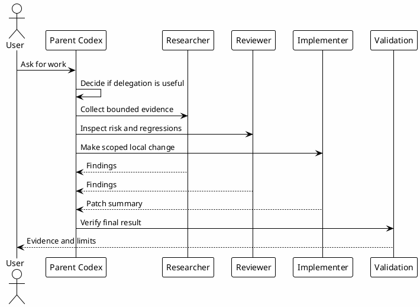

# 07 - Agents

## In One Sentence

Agents are role definitions used for bounded delegation, not a replacement for the parent agent's judgment.

## What You Will Understand

By the end of this page, you should know when to delegate to an agent and when a simple local read is enough.

## Summary

Agents help when work can be split into clear, bounded responsibilities.

Use agents for:

- read-only research slices;
- independent review lanes;
- scoped implementation after a plan exists;
- parallel evidence collection.

Do not use agents for every small question. The parent agent remains responsible for final synthesis, decisions and user communication.

## Flow



## Local Configuration Steps

1. Create `~/.codex/agents`.
2. Download the templates.
3. Keep roles narrow and explicit.
4. Use cheaper read-only tiers for research and review.
5. Use implementer only for scoped local changes.

- [Download copilot.toml](templates/agents/copilot.toml)
- [Download researcher.toml](templates/agents/researcher.toml)
- [Download reviewer.toml](templates/agents/reviewer.toml)
- [Download implementer.toml](templates/agents/implementer.toml)

```bash
mkdir -p ~/.codex/agents
```

## Why It Works

Delegation works when the task has clear ownership and a small surface area. It fails when agents are asked to make broad decisions without enough context.

## Checkpoint

```bash
rtk proxy find ~/.codex/agents -maxdepth 1 -type f -name '*.toml' -print
rtk sed -n '1,80p' ~/.codex/agents/researcher.toml
```

You should be able to explain when to use `researcher`, `reviewer` and `implementer`.

## Next Module

Go to [[08-hooks]].
