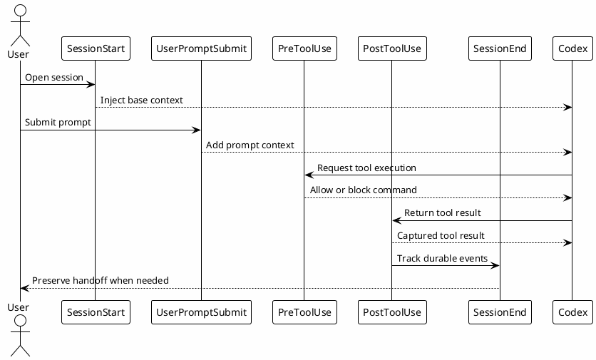

# 08 - Hooks

## Em uma frase

Hooks são scripts locais que rodam automaticamente em pontos da sessão para adicionar contexto, bloquear risco ou registrar aprendizado.

## O que você vai entender

Ao final desta página, você deve conseguir dizer quando um comportamento deveria virar hook em vez de skill ou regra escrita.

## Resumo

Hooks são automações locais chamadas pelo runtime do Codex em pontos específicos da sessão.

Eles fazem o trabalho que não deve depender da memória do modelo:

- injetar contexto;
- bloquear comandos perigosos;
- registrar uso de ferramentas;
- salvar memória;
- medir output de MCP;
- preservar transcript antes de compaction.

## Diagrama



## Hooks Principais

| Hook | Arquivo | Papel |
|---|---|---|
| `SessionStart` | `session_start_context.py` | Injeta contexto base, ambiente e aviso de Session-Memory. |
| `UserPromptSubmit` | `user_prompt_context.py` | Adiciona contexto por prompt e bloqueia prompt inline grande. |
| `PreToolUse` | `pre_tool_use_guard.py` | Bloqueia comandos destrutivos, ruidosos ou fora de policy. |
| `PostToolUse` | `post_tool_use_tracker.py` | Registra eventos como vault query e worktree setup. |
| `PostToolUse mcp__.*` | `mcp-output-analytics.sh` | Mede tamanho de output de MCP. |
| `SessionEnd` | `session_end_save.py` | Resume sessão para Session-Memory quando possível. |
| `PreCompact` | `precompact_backup.py` | Faz backup antes de compaction. |
| `PostCompact` | `postcompact_log.py` | Registra compaction. |

## Quando Um Hook Faz Sentido

Use hook quando a regra é mecânica e deve rodar sempre no mesmo momento.

Exemplos bons:

- bloquear comando destrutivo antes da execução;
- medir tamanho de output de MCP;
- registrar que uma sessão usou vault;
- salvar handoff no fim da sessão.

Não use hook para ensinar um processo longo. Processo longo normalmente é skill.

## Passo a passo de configuração local

Nesta etapa a pessoa cria scripts locais pequenos e registra esses scripts no `config.toml`.

1. Crie o diretório `~/.codex/hooks`.
2. Baixe os templates abaixo.
3. Salve os arquivos em `~/.codex/hooks/`.
4. Marque os scripts como executáveis.
5. Registre os hooks no `~/.codex/config.toml`.
6. Ative primeiro os hooks de contexto e guardrail. Depois adicione tracking e memória.

Templates:

- [Download hook_lib.py](templates/hooks/hook_lib.py)
- [Download session_start_context.py](templates/hooks/session_start_context.py)
- [Download user_prompt_context.py](templates/hooks/user_prompt_context.py)
- [Download pre_tool_use_guard.py](templates/hooks/pre_tool_use_guard.py)
- [Download post_tool_use_tracker.py](templates/hooks/post_tool_use_tracker.py)
- [Download session_end_save.py](templates/hooks/session_end_save.py)
- [Download permission_request_log.py](templates/hooks/permission_request_log.py)
- [Download precompact_backup.py](templates/hooks/precompact_backup.py)
- [Download postcompact_log.py](templates/hooks/postcompact_log.py)
- [Download mcp-output-analytics.sh](templates/hooks/mcp-output-analytics.sh)
- [Download token-monitor.sh](templates/hooks/token-monitor.sh)
- [Download worktree_setup.py](templates/hooks/worktree_setup.py)

Comandos para aplicar:

```bash
mkdir -p ~/.codex/hooks
chmod +x ~/.codex/hooks/*.py ~/.codex/hooks/*.sh
$EDITOR ~/.codex/config.toml
```

Bloco de registro no `config.toml`:

```toml
[[hooks.SessionStart]]
matcher = "startup|resume|clear"

[[hooks.SessionStart.hooks]]
command = "python3 ABSOLUTE/PATH/TO/.codex/hooks/session_start_context.py"

[[hooks.UserPromptSubmit]]
matcher = ".*"

[[hooks.UserPromptSubmit.hooks]]
command = "python3 ABSOLUTE/PATH/TO/.codex/hooks/user_prompt_context.py"

[[hooks.PreToolUse]]
matcher = ".*"

[[hooks.PreToolUse.hooks]]
command = "python3 ABSOLUTE/PATH/TO/.codex/hooks/pre_tool_use_guard.py"

[[hooks.PostToolUse]]
matcher = ".*"

[[hooks.PostToolUse.hooks]]
command = "python3 ABSOLUTE/PATH/TO/.codex/hooks/post_tool_use_tracker.py"

[[hooks.SessionEnd]]
matcher = ".*"

[[hooks.SessionEnd.hooks]]
command = "python3 ABSOLUTE/PATH/TO/.codex/hooks/session_end_save.py"

[[hooks.PreCompact]]
matcher = ".*"

[[hooks.PreCompact.hooks]]
command = "python3 ABSOLUTE/PATH/TO/.codex/hooks/precompact_backup.py"

[[hooks.PostCompact]]
matcher = ".*"

[[hooks.PostCompact.hooks]]
command = "python3 ABSOLUTE/PATH/TO/.codex/hooks/postcompact_log.py"
```

Hooks opcionais:

```toml
[[hooks.PermissionRequest]]
matcher = ".*"

[[hooks.PermissionRequest.hooks]]
command = "python3 ABSOLUTE/PATH/TO/.codex/hooks/permission_request_log.py"

[[hooks.PostToolUse]]
matcher = "mcp__.*"

[[hooks.PostToolUse.hooks]]
command = "ABSOLUTE/PATH/TO/.codex/hooks/mcp-output-analytics.sh"
```

Se o runtime usado por uma pessoa ainda não suportar algum evento, remova aquele bloco e mantenha apenas os hooks suportados.

## Por que funciona

Hooks rodam fora do raciocínio do modelo. Eles são bons para regras mecânicas e repetitivas.

Exemplos:

- impedir `git reset --hard`;
- bloquear prompt inline grande;
- exigir `rtk` para comandos ruidosos;
- lembrar que trabalho LE deve consultar vault;
- registrar que `local-le-vault` foi usado.

## Erros comuns

- Ativar hook sem permissão de execução.
- Registrar path relativo quando o runtime espera path absoluto.
- Criar hook para regra que ainda está mudando todos os dias.
- Bloquear comandos demais e impedir trabalho normal.

## Conhecimento Produzido

Hooks produzem rastros operacionais:

- logs de permission request;
- analytics de output MCP;
- trackers de vault usage;
- entries de Session-Memory;
- avisos de ambiente.

Esses logs ficam locais em `~/.codex/logs/`. Eles servem para aprendizado e troubleshooting, não para publicação bruta.

## Checkpoint

```bash
rtk rg -n '^\\[\\[hooks\\.' ~/.codex/config.toml
rtk proxy find ~/.codex/hooks -maxdepth 1 -type f -print
rtk proxy find ~/.codex/hooks -maxdepth 1 -type f -perm +111 -print
rtk test -f ~/.codex/hooks/hook_lib.py
```

Teste indireto:

- rode uma query vault e confirme que o tracker foi observado;
- tente planejar um comando destrutivo e confirme que o guardrail bloquearia;
- envie prompt grande via arquivo, não inline.

## Próximo Módulo

Siga para [[09-mcp-and-connectors-setup]].
