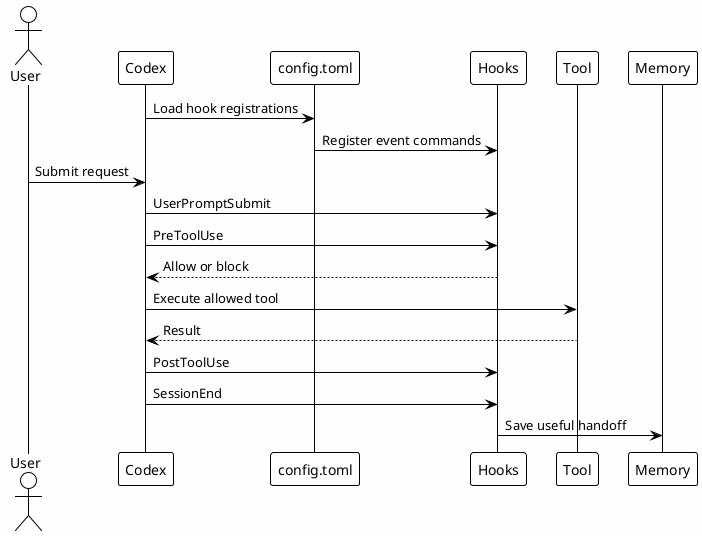

# 08 - Hooks

## In One Sentence

Hooks are local scripts that run at defined moments to inject context, track activity or block unsafe commands.

## What You Will Understand

By the end of this page, you should understand how hooks are registered, what each event means and why `PreToolUse` is the main guardrail point.

## Summary

Hooks make rules operational.

Rules say what should happen. Hooks can observe or enforce part of that behavior when tools are used.

Common hook moments:

| Event | Purpose |
|---|---|
| `SessionStart` | Add startup or resume context. |
| `UserPromptSubmit` | Inspect the user request before work begins. |
| `PreToolUse` | Block risky commands before execution. |
| `PostToolUse` | Track activity or collect metrics after tools run. |
| `SessionEnd` | Save useful session handoff. |
| `PreCompact` and `PostCompact` | Preserve continuity around compaction. |
| `PermissionRequest` | Log or review approval requests. |

## Flow



## Local Configuration Steps

1. Create `~/.codex/hooks`.
2. Download the templates below.
3. Make scripts executable when needed.
4. Register hook commands in `~/.codex/config.toml`.
5. Test with safe read-only commands first.

- [Download hook_lib.py](templates/hooks/hook_lib.py)
- [Download session_start_context.py](templates/hooks/session_start_context.py)
- [Download user_prompt_context.py](templates/hooks/user_prompt_context.py)
- [Download pre_tool_use_guard.py](templates/hooks/pre_tool_use_guard.py)
- [Download post_tool_use_tracker.py](templates/hooks/post_tool_use_tracker.py)
- [Download session_end_save.py](templates/hooks/session_end_save.py)
- [Download permission_request_log.py](templates/hooks/permission_request_log.py)
- [Download precompact_backup.py](templates/hooks/precompact_backup.py)
- [Download postcompact_log.py](templates/hooks/postcompact_log.py)
- [Download mcp-output-analytics.sh](templates/hooks/mcp-output-analytics.sh)
- [Download token-monitor.sh](templates/hooks/token-monitor.sh)
- [Download worktree_setup.py](templates/hooks/worktree_setup.py)

```bash
mkdir -p ~/.codex/hooks
chmod +x ~/.codex/hooks/*.py ~/.codex/hooks/*.sh
$EDITOR ~/.codex/config.toml
```

## Why It Works

Hooks run close to the tool boundary. That makes them useful for token economy, command safety, context injection and durable session tracking.

## Main Hooks

| Hook | Purpose |
|---|---|
| `SessionStart` | Load startup context. |
| `UserPromptSubmit` | Add prompt-time context and routing hints. |
| `PreToolUse` | Block or warn before risky tool usage. |
| `PostToolUse` | Track command/tool output and useful metadata. |
| `PreCompact` | Save context before compaction. |
| `PostCompact` | Register compaction events. |
| `SessionEnd` | Save final handoff or memory. |

## When A Hook Makes Sense

A hook makes sense when the behavior must happen automatically and consistently. If the action is optional or requires judgment, a skill or rule may be better.

## Common Mistakes

- Putting too much logic into hooks.
- Letting hooks mutate external systems.
- Assuming hooks replace human approval.
- Forgetting to make hook output short and useful.

## Knowledge Produced

Hooks can produce reusable signals:

- command tracking;
- permission requests;
- session start/end context;
- MCP output analytics;
- compaction handoff metadata.

## Checkpoint

```bash
rtk rg -n '^\[\[hooks\.' ~/.codex/config.toml
rtk proxy find ~/.codex/hooks -maxdepth 1 -type f -print
python3 -m py_compile ~/.codex/hooks/*.py
```

Do not test hooks with destructive commands. Confirm the guardrail exists and use safe commands.

## Next Module

Go to [[09-mcp-and-connectors-setup]].
