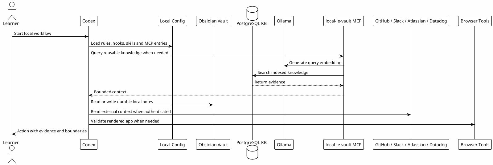

# 08.5 - External Apps and Services

## In One Sentence

The Codex workflow depends on a few tools outside Codex because they provide context, evidence, authentication and synchronization.

## What You Will Understand

By the end of this page, you should know which external apps must be prepared, which ones are optional, and what each one contributes to the workflow.

## Summary

Codex is the local operator, but it is not the whole system.

Some parts of the workflow live outside Codex:

- Obsidian stores authored knowledge and Session-Memory.
- PostgreSQL can store indexed knowledge for retrieval when `local-le-vault` is enabled.
- Ollama can generate local embeddings for semantic search when `local-le-vault` is enabled.
- GitHub stores repositories, PRs and code history.
- Slack, Atlassian and Datadog provide team, planning and production evidence.
- Browser tooling validates rendered UI and local apps.
- Context7 retrieves current library documentation.

These tools do not all need to be ready on the first page. They become necessary when the learner reaches the configuration or validation step that uses them.

## Required vs Optional

| Layer | Required for first setup? | Required for local knowledge search? | Why |
|---|---:|---:|---|
| Terminal | Yes | Yes | Runs Codex, setup commands and validation checks. |
| WSL2 on Windows | Windows users only | Yes for Windows users | Provides the Linux environment where Codex, paths, wrappers and MCP servers run consistently. |
| Codex CLI | Yes | Yes | Loads local configuration, hooks, skills, subagents and MCPs. |
| Git | Yes | No | Lets the learner version local configuration and inspect repos. |
| GitHub account | Recommended | No | Needed for repositories, PR context and code history. |
| Obsidian or Markdown vault | No | Yes | Stores durable notes, handoffs, runbooks and Session-Memory. |
| PostgreSQL + pgvector | No | Yes | Stores indexed reusable knowledge for `local-le-vault`. |
| Ollama | No | Yes | Generates local embeddings used by semantic search. |
| GitHub connector or CLI auth | No | Useful | Reads PRs, issues, branches and repo metadata. |
| Slack connector | No | Useful | Reads team context and drafts messages when approved. |
| Atlassian MCP | No | Useful | Reads Jira and Confluence context. |
| Datadog MCP | No | Useful | Reads logs, traces, metrics, monitors and incidents. |
| Browser / Chrome DevTools | No | Useful | Validates rendered UI, console errors and local app behavior. |
| Context7 | No | Useful | Fetches current documentation for libraries and APIs. |
| Probe | No | Useful | Helps semantic codebase orientation. |

## Setup Order

Do not try to configure every integration before Codex itself works.

Use this order:

1. Prepare terminal, Git and Codex CLI.
2. On Windows, prepare WSL2 first and use Linux paths.
3. Create `~/.codex` and fill template variables.
4. Copy rules, config, subagents, hooks and skills.
5. Prepare the vault path and Session-Memory location.
6. If using local indexed knowledge, prepare PostgreSQL + pgvector and Ollama for `local-le-vault`.
7. Configure MCP wrappers and local secrets.
8. Authenticate external connectors only when the learner needs that evidence source.
9. Validate each integration independently before using it on real work.

## Flow

## Configuration Notes

### Obsidian Or Markdown Vault

Use a local vault for durable context:

- Session-Memory;
- runbooks;
- review learnings;
- project notes;
- gotchas;
- handoffs.

The workbook should never ship a private vault path. The learner fills their own `Vault` value in the template variables step.

### PostgreSQL and Ollama

PostgreSQL and Ollama are optional. They are needed only when the learner wants `local-le-vault` to query indexed local knowledge.

That local knowledge path needs:

- PostgreSQL running locally;
- `pgvector` available;
- a database for indexed knowledge;
- an embedding model available through Ollama;
- the `local-le-vault` MCP wrapper pointing to the correct server script and database URL.

The public template should use placeholders. Real connection strings belong in local secrets.

### GitHub

GitHub is used for:

- repository context;
- PR and branch history;
- issue metadata when available;
- examples of prior implementation and review decisions.

For learners, reading repo and PR context is what matters for day-to-day engineering.

### Slack, Atlassian and Datadog

These integrations are evidence sources:

- Slack: team discussions, incident context and human decisions;
- Atlassian: Jira tickets and Confluence documentation;
- Datadog: logs, traces, metrics, monitors and production symptoms.

Read-only usage is usually safe. Write actions, such as posting Slack messages or changing Jira, still require explicit approval.

### Browser Tooling

Browser tooling is part of the workflow when the task touches UI.

It helps validate:

- the app is not blank;
- no framework error overlay appears;
- console errors are understood;
- the UI responds after interaction;
- desktop and mobile layouts remain usable.

## How to Validate

Before moving to real work, each person should be able to answer:

- Which tools are required now?
- Which tools are only needed for local indexed knowledge?
- Where do real tokens and connection strings live?
- Which integrations are read-only evidence sources?
- Which actions still require explicit approval?
- How does PostgreSQL stay connected to `local-le-vault`?

## Common Mistakes

- Trying to install every external app before Codex CLI works.
- Putting private paths or tokens in public templates.
- Treating GitHub as a publishing task instead of an engineering evidence source.
- Treating Slack, Jira or Datadog output as final truth without current validation.
- Configuring `local-le-vault` before PostgreSQL, Ollama and the MCP wrapper can run, when using the local indexed knowledge path.
- Forgetting that external writes still need explicit approval.

## Checkpoint

You should be able to classify each dependency as:

- required for first setup;
- required for local indexed knowledge;
- optional evidence source;
- collaboration or evidence layer.

## Next Module

Go to [[09-mcp-and-connectors-setup]].
