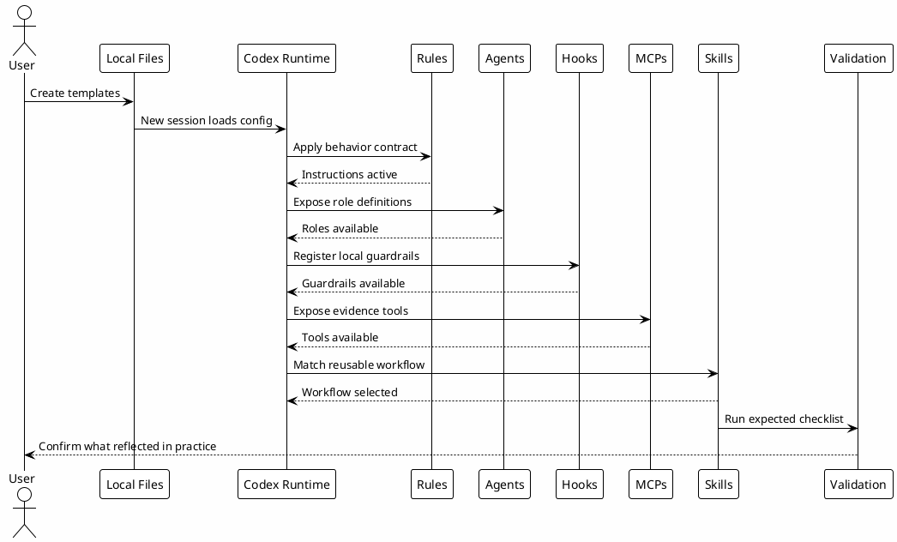

# 09.5 - Local Configuration Hands-on

## In One Sentence

The hands-on step confirms whether the local configuration you copied actually changes Codex behavior.

## What You Will Understand

By the end of this page, you should be able to test rules, agents, hooks, MCPs and skills without depending on a large real task.

## Summary

This step validates whether local configuration is more than files on disk.

Test in small blocks before using the setup on real work. That avoids mixing hook errors, MCP errors and skill errors into the same investigation.

The goal is to test five things:

- rules loaded as behavior;
- agents available as bounded roles;
- hooks registered as local guardrails;
- MCPs and connectors available as evidence sources;
- skills usable as reusable workflows.

## Hands-on Map



## Before You Start

Confirm the files exist:

```bash
rtk test -f ~/.codex/config.toml
rtk test -f ~/.codex/AGENTS.md
rtk test -f ~/.codex/RTK.md
rtk proxy find ~/.codex/agents -maxdepth 1 -type f -name '*.toml' -print
rtk proxy find ~/.codex/hooks -maxdepth 1 -type f -print
rtk rg -n '^\[mcp_servers\.|^\[plugins\.' ~/.codex/config.toml
rtk proxy find ~/.codex/skills -maxdepth 2 -name SKILL.md -print
```

If a command fails, return to the corresponding page before continuing.

## Test 1 - Rules

Open a new Codex session inside a local project and ask:

```text
Show the repo status and explain in one sentence what you checked.
```

Expected result:

- answer in English;
- controlled command output;
- no mutation attempt;
- short explanation of what was checked.

## Test 2 - Agents

Validate files:

```bash
rtk sed -n '1,80p' ~/.codex/agents/copilot.toml
rtk sed -n '1,80p' ~/.codex/agents/researcher.toml
rtk sed -n '1,80p' ~/.codex/agents/reviewer.toml
rtk sed -n '1,80p' ~/.codex/agents/implementer.toml
```

Then ask conceptually:

```text
Explain which agent you would use for read-only evidence collection and why.
```

## Test 3 - Hooks

```bash
rtk rg -n '^\[\[hooks\.' ~/.codex/config.toml
rtk proxy find ~/.codex/hooks -maxdepth 1 -type f -print
```

Do not test hooks with destructive commands.

## Test 4 - MCPs And Connectors

```bash
rtk rg -n '^\[mcp_servers\.|^\[plugins\.' ~/.codex/config.toml
rtk test -f ~/.codex/.mcp-secrets
rtk proxy find ~/.codex/hooks -maxdepth 1 -name 'mcp-*.sh' -print
```

Then ask:

```text
Explain which MCPs you would use for current documentation, local browser review and vault knowledge.
```

## Test 5 - Skills

```bash
rtk sed -n '1,120p' ~/.codex/skills/example-workflow/SKILL.md
rtk rg -n '^name:|^description:' ~/.codex/skills -g 'SKILL.md'
```

Then ask a request that matches the description.

## How To Know It Reflected

Configuration reflected when:

- rules change behavior without repeating instructions;
- agents appear as roles with clear limits;
- hooks run or block around tool usage;
- MCPs and connectors provide evidence without manual context paste;
- skills load when the request matches the workflow.

## How Each Skill Enters The Workflow

| Skill | Example trigger | What to observe |
|---|---|---|
| `study` | "Analyze before coding" | It gathers context and creates a plan. |
| `feature-dev` | "Implement from this plan" | It follows the plan and validates locally. |
| `investigation` | "Find why this happens" | It gathers evidence before proposing changes. |
| `codereview` | "Review this PR" | It leads with findings and risk. |
| `session-memory` | "Save everything" | It appends durable handoff context. |

## Common Mistakes

- Expecting every skill to trigger automatically.
- Testing skills with vague prompts.
- Forgetting to verify that downloaded templates were copied to the right directory.
- Treating a successful download as proof that Codex loaded the skill.

## Next Module

Go to [[10-token-economy]].
