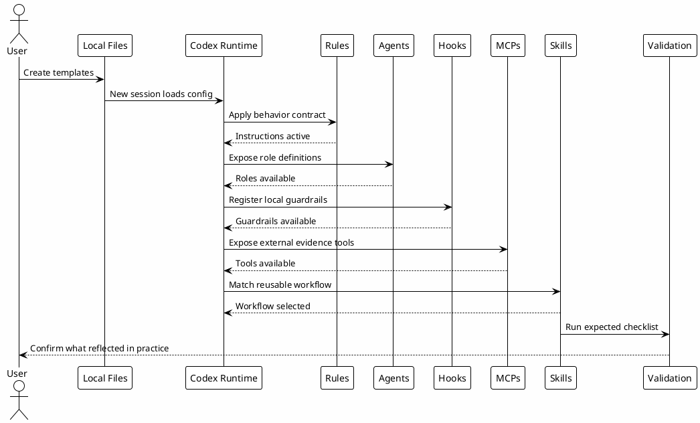

# 09.5 - Local Configuration Hands-on

## Em uma frase

O hands-on confirma se a configuração local que você copiou realmente aparece no comportamento do Codex.

## O que você vai entender

Ao final desta página, você deve conseguir testar rules, agents, hooks, MCPs e skills sem depender de uma tarefa real grande.

## Resumo

Esta etapa valida se a configuração local deixou de ser apenas arquivo e passou a influenciar o workflow.

Ela segue a mesma lógica de workshop: testar em blocos pequenos antes de usar em uma tarefa real. Isso reduz a chance de uma pessoa misturar erro de hook, erro de MCP e erro de skill no mesmo teste.

O objetivo é testar cinco coisas:

- rules carregadas como comportamento;
- agents disponíveis como papéis delegáveis;
- hooks registrados como guardrails locais;
- MCPs e connectors disponíveis como fontes de evidência;
- skills acionáveis como workflows reutilizáveis.

## Mapa Do Hands-on



## Antes de começar

Confirme que estes arquivos existem:

```bash
rtk test -f ~/.codex/config.toml
rtk test -f ~/.codex/AGENTS.md
rtk test -f ~/.codex/RTK.md
rtk proxy find ~/.codex/agents -maxdepth 1 -type f -name '*.toml' -print
rtk proxy find ~/.codex/hooks -maxdepth 1 -type f -print
rtk rg -n '^\\[mcp_servers\\.|^\\[plugins\\.' ~/.codex/config.toml
rtk proxy find ~/.codex/skills -maxdepth 2 -name SKILL.md -print
```

Se algum comando falhar, volte para a página correspondente antes de seguir.

Se algum item ainda não existe na sua máquina, não force. Volte para a página correspondente, copie o template e valide aquela camada primeiro.

## Teste 1 - Rules

Abra uma nova sessão do Codex dentro de um projeto local e faça um pedido simples:

```text
Mostre o status do repo e explique em uma frase o que você verificou.
```

Resultado esperado:

- resposta em inglês;
- comandos com output controlado;
- nenhuma tentativa de mutação;
- explicação curta do que foi verificado.

Rules refletem quando o comportamento aparece sem você repetir a regra no prompt.

## Teste 2 - Agents

Valide os arquivos:

```bash
rtk sed -n '1,80p' ~/.codex/agents/copilot.toml
rtk sed -n '1,80p' ~/.codex/agents/researcher.toml
rtk sed -n '1,80p' ~/.codex/agents/reviewer.toml
rtk sed -n '1,80p' ~/.codex/agents/implementer.toml
```

Depois, em uma sessão nova, peça um uso conceitual:

```text
Explique qual agent você usaria para coletar evidência read-only e por que.
```

Resultado esperado:

- `researcher` para coleta de evidência;
- `reviewer` para findings e risco;
- `implementer` apenas para mudança local com escopo claro;
- parent agent continua responsável pela síntese final.

## Teste 3 - Hooks

Valide registro e permissão:

```bash
rtk rg -n '^\\[\\[hooks\\.' ~/.codex/config.toml
rtk proxy find ~/.codex/hooks -maxdepth 1 -type f -perm +111 -print
```

Depois teste um caminho seguro:

```bash
rtk git status --short
```

Resultado esperado:

- hooks registrados no `config.toml`;
- scripts executáveis;
- comandos seguros seguem funcionando;
- comandos destrutivos devem ser bloqueados pelo guardrail antes da execução.

Não rode comandos destrutivos para testar. O teste aqui é confirmar que o hook está registrado e que o script contém a regra de bloqueio.

## Teste 4 - MCPs e Connectors

Valide que as entradas existem sem imprimir segredos:

```bash
rtk rg -n '^\\[mcp_servers\\.|^\\[plugins\\.' ~/.codex/config.toml
rtk test -f ~/.codex/.mcp-secrets
rtk proxy find ~/.codex/hooks -maxdepth 1 -name 'mcp-*.sh' -print
```

Depois faça um teste conceitual em uma sessão nova:

```text
Explique quais MCPs você usaria para consultar documentação atual, revisar browser local e buscar conhecimento do vault.
```

Resultado esperado:

- `context7` para documentação atual;
- `chrome-devtools` para browser e UI;
- `local-le-vault` para conhecimento indexado;
- GitHub e Slack tratados como connectors autenticados, não como tokens em arquivo público;
- nenhum segredo exibido na resposta.

## Teste 5 - Skills

Crie ou valide uma skill simples:

```bash
rtk sed -n '1,120p' ~/.codex/skills/example-workflow/SKILL.md
rtk rg -n '^name:|^description:' ~/.codex/skills -g 'SKILL.md'
```

Depois peça algo que combine com a description:

```text
Use o workflow example-workflow para verificar este README e retornar passos, validação e risco restante.
```

Resultado esperado:

- o Codex identifica a skill pelo nome ou pela description;
- segue os passos definidos no `SKILL.md`;
- retorna output no formato esperado;
- não inventa etapas fora do contrato da skill.

## Como Cada Skill Entra No Workflow

| Tipo de skill | Quando entra | O que deve produzir |
|---|---|---|
| `study` | Antes de implementação incerta. | Plano e riscos. |
| `feature-dev` | Depois de plano claro. | Mudança local validada. |
| `investigation` | Quando há comportamento incerto. | Evidência e conclusão. |
| `debug-mode` | Quando precisa provar uma causa. | Hipóteses, logs e fix. |
| `codereview` | Antes de PR ou quando há review. | Findings por severidade. |
| `session-memory` | Quando aprendizado precisa sobreviver. | Nota durável de continuidade. |

O ponto não é usar todas sempre. O ponto é saber qual workflow reutilizável reduz improviso naquele momento.

## Como Saber Que Refletiu

Uma configuração refletiu quando você consegue observar efeito prático:

- rules mudam comportamento sem repetir instrução;
- agents aparecem como papéis com limites claros;
- hooks rodam ou bloqueiam antes/depois de ferramentas;
- MCPs e connectors fornecem evidência sem colar contexto manualmente;
- skills são carregadas quando o pedido combina com o workflow;
- checkpoints mostram que a pessoa sabe validar o próprio setup.

## Erros comuns

- Testar tudo em uma única tarefa grande. Prefira um teste pequeno por camada.
- Achar que uma skill falhou porque não apareceu o nome dela na resposta. O importante é o comportamento seguir o contrato.
- Testar MCP autenticado antes de resolver secrets e wrappers.
- Marcar a página como concluída sem conseguir explicar qual camada foi validada.

## Checkpoint

Antes de seguir, valide apenas o entendimento operacional:

- qual arquivo muda comportamento global;
- qual arquivo define rules;
- onde agents ficam;
- onde hooks ficam;
- onde MCPs e connectors são declarados;
- onde skills ficam;
- como testar sem executar comando destrutivo.

## Próximo Módulo

Siga para [[10-token-economy]].
