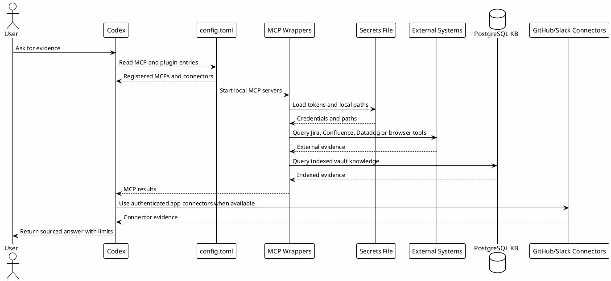

# 08.5 - MCPs and Connectors Setup

## Em uma frase

MCPs e connectors são pontes entre Codex e fontes de conhecimento, ferramentas ou serviços externos.

## O que você vai entender

Ao final desta página, você deve conseguir separar MCP local, connector autenticado, wrapper e arquivo de secrets.

## Resumo

MCPs e connectors conectam o Codex a fontes de contexto que não deveriam ser copiadas manualmente para o prompt.

Nesta etapa a pessoa instala ou habilita:

- MCPs locais por `stdio`, como `chrome-devtools`, `context7`, `probe`, `mcp-atlassian`, `datadog-mcp` e `local-le-vault`;
- connectors/plugins autenticados, como GitHub e Slack;
- wrappers para carregar credenciais fora do `config.toml`;
- validações simples para saber se cada camada está pronta.

O objetivo não é forçar todo mundo a usar todos os MCPs no primeiro dia. O objetivo é deixar o caminho replicável, com cada fonte habilitada quando fizer sentido.

## Diagrama



## MCP Local vs Connector

| Tipo | Exemplos | Como autentica | Onde configura |
|---|---|---|---|
| MCP local `stdio` | `chrome-devtools`, `context7`, `probe` | Geralmente sem token local ou via tool login. | `~/.codex/config.toml` |
| MCP com wrapper | `mcp-atlassian`, `local-le-vault` | `~/.codex/.mcp-secrets` e variáveis de ambiente. | wrapper em `~/.codex/hooks/` |
| MCP com OAuth | `datadog-mcp` | OAuth pelo fluxo do provider ou CLI local. | `config.toml` + CLI do provider |
| Connector/plugin | GitHub, Slack | App connector autorizado pelo usuário. | `[plugins."..."]` no `config.toml` |

GitHub e Slack entram aqui como connectors porque normalmente dependem do app autenticado, não de token colado no arquivo público.

## Analogia Simples

Pense em MCP como uma tomada local que o Codex sabe chamar. Pense em connector como uma integração autenticada com um serviço externo.

O template ensina onde a tomada fica. O segredo real, como token ou connection string, fica fora do template.

## Templates

Baixe estes modelos e revise antes de usar:

- [Download codex-mcp-config.toml](templates/mcp/codex-mcp-config.toml)
- [Download .mcp-secrets.example](templates/mcp/.mcp-secrets.example)
- [Download mcp-credentials.sh](templates/mcp/mcp-credentials.sh)
- [Download mcp-atlassian-wrapper.sh](templates/mcp/mcp-atlassian-wrapper.sh)
- [Download mcp-local-le-vault-wrapper.sh](templates/mcp/mcp-local-le-vault-wrapper.sh)
- [Download mcp-probe-wrapper.sh](templates/mcp/mcp-probe-wrapper.sh)
- [Download verify-mcp-setup.sh](templates/mcp/verify-mcp-setup.sh)

Aplicação base:

```bash
mkdir -p ~/.codex/hooks
cp .mcp-secrets.example ~/.codex/.mcp-secrets
$EDITOR ~/.codex/.mcp-secrets
cp mcp-credentials.sh ~/.codex/hooks/
cp mcp-atlassian-wrapper.sh ~/.codex/hooks/
cp mcp-local-le-vault-wrapper.sh ~/.codex/hooks/
cp mcp-probe-wrapper.sh ~/.codex/hooks/
chmod +x ~/.codex/hooks/mcp-*.sh
```

Depois copie para `~/.codex/config.toml` apenas as entradas dos MCPs que você quer habilitar.

## Bloco de configuração

```toml
[mcp_servers.chrome-devtools]
command = "npx"
args = ["chrome-devtools-mcp@1.0.1"]

[mcp_servers.context7]
command = "npx"
args = ["-y", "@upstash/context7-mcp@2.3.0"]

[mcp_servers.datadog-mcp]
command = "DATADOG_MCP_CLI_PATH"
args = ["--site", "ap2", "--force-oauth"]

[mcp_servers.local-le-vault]
command = "ABSOLUTE/PATH/TO/.codex/hooks/mcp-local-le-vault-wrapper.sh"
args = []

[mcp_servers.mcp-atlassian]
command = "ABSOLUTE/PATH/TO/.codex/hooks/mcp-atlassian-wrapper.sh"
args = []

[mcp_servers.playwright]
command = "npx"
args = ["@playwright/mcp@0.0.75", "--viewport-size", "1440x900"]

[mcp_servers.probe]
command = "ABSOLUTE/PATH/TO/.codex/hooks/mcp-probe-wrapper.sh"
args = ["mcp"]

[plugins."github@openai-curated"]
enabled = true

[plugins."slack@openai-curated"]
enabled = true
```

## Ordem Recomendada

Comece por MCPs sem segredo:

```bash
npx -y @upstash/context7-mcp@2.3.0 --help
npx -y chrome-devtools-mcp@1.0.1 --help
npx -y @probelabs/probe@0.6.0-rc319 --help
```

Depois habilite connectors:

```bash
gh auth status
```

GitHub e Slack precisam de autorização pelo connector/app quando o Codex solicitar. Não coloque tokens pessoais desses sistemas no template público.

Depois habilite MCPs com credenciais:

```bash
$EDITOR ~/.codex/.mcp-secrets
rtk rg -n 'JIRA_API_TOKEN|CONFLUENCE_API_TOKEN|DATABASE_URL' ~/.codex/.mcp-secrets
```

Por fim, habilite Datadog quando a pessoa tiver permissão de observabilidade:

```bash
datadog_mcp_cli --site ap2 --force-oauth
```

O Datadog MCP está em evolução ativa. Para setup real, confira também a documentação oficial do Datadog MCP antes de publicar um guia fechado para o time.

## Papel de cada MCP

| MCP ou connector | Papel no workflow | Quando usar |
|---|---|---|
| `chrome-devtools` | Inspecionar browser, console, DOM e debugging visual. | Frontend, E2E, layout e erros de runtime. |
| `context7` | Buscar documentação atual de bibliotecas e frameworks. | Quando API, sintaxe ou versão podem ter mudado. |
| `github@openai-curated` | Ler repos, PRs, issues e metadados GitHub. | Prior art, PRs, branches, reviews e publicação. |
| `slack@openai-curated` | Buscar contexto de conversas e decisões humanas. | Incidentes, alinhamentos, threads e decisões recentes. |
| `mcp-atlassian` | Acessar Jira e Confluence. | Tickets, acceptance criteria, docs e runbooks. |
| `datadog-mcp` | Ler observabilidade. | Logs, traces, métricas, monitors, dashboards e incidentes. |
| `probe` | Buscar e navegar código semanticamente. | Entender símbolos, call flow e padrões locais. |
| `local-le-vault` | Consultar conhecimento indexado do vault. | Gotchas, business rules, reviews, runbooks e memória reutilizável. |

## Segurança

Regras obrigatórias:

- não commitar `~/.codex/.mcp-secrets`;
- não publicar tokens, connection strings ou paths privados;
- não colar output de `env` em issues, Slack ou docs públicos;
- deixar wrappers carregarem segredos via ambiente;
- usar OAuth quando o provider suportar;
- habilitar apenas MCPs que a pessoa tem permissão para usar.

## Erros comuns

- Colocar token direto no template público.
- Misturar MCP local com connector autenticado.
- Instalar todos os MCPs antes de entender quais fontes o workflow realmente precisa.
- Não testar wrappers isoladamente antes de registrar no `config.toml`.

## Por que funciona

Funciona porque separa três responsabilidades:

- `config.toml` declara quais ferramentas existem;
- wrappers resolvem credenciais e paths locais;
- MCPs e connectors buscam evidência quando a skill ou o workflow precisa.

Assim o prompt fica menor e o conhecimento reutilizável continua fora da conversa até ser necessário.

## Conhecimento Produzido

Esta camada pode produzir:

- achados de investigação;
- links para PRs, tickets e docs;
- trechos de logs e traces;
- gotchas novos;
- entradas de Session-Memory;
- material que depois vira conhecimento indexado no vault.

## Checkpoint

Valide configuração sem imprimir segredos:

```bash
rtk rg -n '^\\[mcp_servers\\.|^\\[plugins\\.' ~/.codex/config.toml
rtk test -f ~/.codex/.mcp-secrets
rtk proxy find ~/.codex/hooks -maxdepth 1 -name 'mcp-*.sh' -perm +111 -print
```

Valide entendimento:

- você sabe diferenciar MCP local de connector autenticado;
- você sabe que tokens ficam em `~/.codex/.mcp-secrets`, não no template público;
- você sabe quais MCPs são opcionais;
- você sabe que `local-le-vault` depende do PostgreSQL local e do vault indexado;
- você sabe que GitHub e Slack dependem do app connector autorizado.

## Próximo Módulo

Siga para [[09-skills]].
