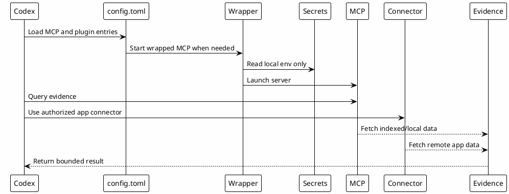

# 09 - MCPs And Connectors

## In One Sentence

MCPs and connectors let Codex fetch evidence without pasting all context into the prompt.

## What You Will Understand

By the end of this page, you should understand the difference between local MCP servers, wrapped MCPs, OAuth-based tools and app connectors.

## Summary

MCPs expose tools to Codex. Connectors expose authenticated app capabilities.

They should be configured with a clear boundary: public templates describe shape, while real credentials stay local.

## Types

| Type | Examples | Credential location |
|---|---|---|
| Local stdio MCP | `chrome-devtools`, `context7`, `probe` | Usually no local token or provider login. |
| Wrapped MCP | `mcp-atlassian`, `local-le-vault` | `~/.codex/.mcp-secrets` and wrapper env vars. |
| OAuth MCP | `datadog-mcp` | Provider OAuth or local CLI. |
| Connector/plugin | GitHub, Slack | Authorized app connector. |

## Flow



## Local Configuration Steps

Download and review these models:

- [Download codex-mcp-config.toml](templates/mcp/codex-mcp-config.toml)
- [Download .mcp-secrets.example](templates/mcp/.mcp-secrets.example)
- [Download mcp-credentials.sh](templates/mcp/mcp-credentials.sh)
- [Download mcp-atlassian-wrapper.sh](templates/mcp/mcp-atlassian-wrapper.sh)
- [Download mcp-local-le-vault-wrapper.sh](templates/mcp/mcp-local-le-vault-wrapper.sh)
- [Download mcp-probe-wrapper.sh](templates/mcp/mcp-probe-wrapper.sh)
- [Download verify-mcp-setup.sh](templates/mcp/verify-mcp-setup.sh)

```bash
mkdir -p ~/.codex/hooks
cp .mcp-secrets.example ~/.codex/.mcp-secrets
$EDITOR ~/.codex/.mcp-secrets
chmod +x ~/.codex/hooks/mcp-*.sh
```

Copy only the MCP entries you need into `~/.codex/config.toml`.

## Why It Works

The runtime knows which tools exist, while secrets remain outside public files. Wrappers keep credentials local and make failures easier to diagnose.

## Checkpoint

```bash
rtk rg -n '^\[mcp_servers\.|^\[plugins\.' ~/.codex/config.toml
rtk test -f ~/.codex/.mcp-secrets
rtk proxy find ~/.codex/hooks -maxdepth 1 -name 'mcp-*.sh' -print
```

You should know that tokens stay in `~/.codex/.mcp-secrets`, not in public templates.

## Next Module

Go to [[09-skills]].
