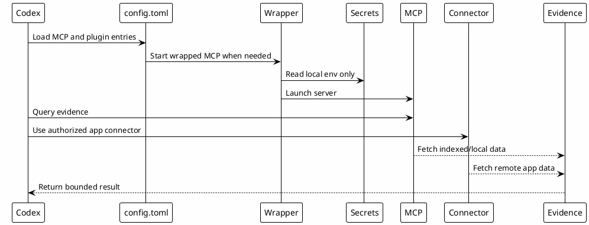

# 09 - MCPs and Connectors

## In One Sentence

MCPs and connectors let Codex fetch evidence without pasting all context into the prompt.

## What You Will Understand

By the end of this page, you should understand the difference between local MCP servers, wrapped MCPs, OAuth-based tools and app connectors.

## Summary

MCPs expose tools to Codex. Connectors expose authenticated app capabilities.

They should be configured with a clear boundary: public templates describe shape, while real credentials stay local.

This page assumes you already understand the external apps from [[09-external-apps-and-services]]. Here the goal is to connect those apps to Codex safely.

## Types

| Type | Examples | Credential location |
|---|---|---|
| Local stdio MCP | `chrome-devtools`, `context7`, `probe` | Usually no local token or provider login. |
| Wrapped MCP | `mcp-atlassian`, `local-le-vault` | `~/.codex/.mcp-secrets` and wrapper env vars. |
| OAuth MCP | `datadog-mcp` | Provider OAuth or local CLI. |
| Connector/plugin | GitHub, Slack | Authorized app connector. |

## Flow



## Local Configuration Steps

Download and review these models:

- [Download codex-mcp-config.toml](templates/mcp/codex-mcp-config.toml)
- [Download .mcp-secrets.example](templates/mcp/.mcp-secrets.example)
- [Download vault_mcp_server.py](templates/mcp/vault_mcp_server.py)
- [Download mcp-credentials.sh](templates/mcp/mcp-credentials.sh)
- [Download mcp-atlassian-wrapper.sh](templates/mcp/mcp-atlassian-wrapper.sh)
- [Download mcp-local-le-vault-wrapper.sh](templates/mcp/mcp-local-le-vault-wrapper.sh)
- [Download mcp-probe-wrapper.sh](templates/mcp/mcp-probe-wrapper.sh)
- [Download verify-mcp-setup.sh](templates/mcp/verify-mcp-setup.sh)

```bash
mkdir -p ~/.codex/hooks
cp .mcp-secrets.example ~/.codex/.mcp-secrets
$EDITOR ~/.codex/.mcp-secrets
chmod +x ~/.codex/hooks/mcp-*.sh
```

Copy only the MCP entries you need into `~/.codex/config.toml`.

Do not enable a wrapper until the app behind it is ready. For example:

- `local-le-vault` needs the PostgreSQL knowledge database, Ollama and the optional vault MCP server script only when local indexed knowledge is enabled;
- `mcp-atlassian` needs an Atlassian MCP command and local credentials;
- `datadog-mcp` needs its local auth flow or CLI path;
- GitHub and Slack connectors need app authorization, not a public template token.

## Why It Works

The runtime knows which tools exist, while secrets remain outside public files. Wrappers keep credentials local and make failures easier to diagnose.

## Local MCP vs Connector

| Type | Runs where | Example |
|---|---|---|
| Local MCP | On the developer machine. | `local-le-vault`, local scripts. |
| Connector | Authenticated external integration. | GitHub, Slack, Datadog, Atlassian. |

## Simple Analogy

Rules tell Codex how to behave. MCPs and connectors tell Codex where to look when the answer requires external or indexed evidence.

## Templates

Use the provided MCP templates as shape, not as private configuration:

- `codex-mcp-config.toml`;
- `mcp-credentials.sh`;
- wrapper scripts for local vault, Probe, Atlassian and Datadog;
- `verify-mcp-setup.sh`.

## Recommended Order

1. Configure local rules first.
2. Prepare the external app or local service behind the integration.
3. Add local MCP wrappers with placeholders.
4. Put secrets in a local ignored file.
5. Verify each MCP independently.
6. Add authenticated connectors only when the learner needs them.

## Role of Each MCP

| MCP / Connector | Role |
|---|---|
| `local-le-vault` | Search local reusable knowledge. |
| `context7` | Fetch current library documentation. |
| GitHub | Read PRs, issues, branches and repo metadata. |
| Slack | Read relevant team context and draft messages. |
| Atlassian | Read Jira and Confluence context. |
| Datadog | Read logs, traces, metrics and monitors. |
| Probe | Semantic code search and codebase orientation. |

## Readiness Checklist

Before expecting a tool to work, validate the dependency behind it:

| Integration | Ready when |
|---|---|
| `local-le-vault` | If enabled, PostgreSQL is reachable, Ollama has the embedding model and the wrapper can start the MCP server. |
| `context7` | The MCP or connector is installed and can fetch current docs. |
| GitHub | The connector or CLI can read repositories and PR metadata. |
| Slack | The connector can read the intended workspace and channel. |
| Atlassian | Jira and Confluence authentication works through the wrapper or connector. |
| Datadog | OAuth or local CLI auth works and read-only observability tools are available. |
| Browser tooling | The browser tool can open a local app and inspect console/runtime state. |
| Probe | The local command can search the target repository. |

## Security

Secrets should live outside public templates, usually in a local ignored file such as `.mcp-secrets`. Public docs should show placeholders only.

## Common Mistakes

- Putting real tokens in templates.
- Enabling every connector before there is a use case.
- Treating external search results as final truth.
- Forgetting that write actions still need approval.

## Knowledge Produced

MCP usage can produce new gotchas, runbook updates, review learnings or Session-Memory entries when the result should be reusable.

## Checkpoint

```bash
rtk rg -n '^\[mcp_servers\.|^\[plugins\.' ~/.codex/config.toml
rtk test -f ~/.codex/.mcp-secrets
rtk proxy find ~/.codex/hooks -maxdepth 1 -name 'mcp-*.sh' -print
```

You should know that tokens stay in `~/.codex/.mcp-secrets`, not in public templates.

## Next Module

Go to [[09-skills]].
