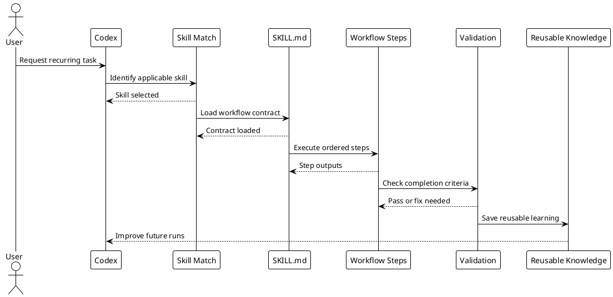

# 09 - Skills

## Em uma frase

Skills transformam um jeito recorrente de trabalhar em um procedimento reutilizável.

## O que você vai entender

Ao final desta página, você deve conseguir criar uma skill simples, instalar uma skill compartilhada e explicar como ela entra no workflow.

## Resumo

Skills são workflows reutilizáveis guardados em `~/.codex/skills/<name>/SKILL.md`.

Uma skill ensina Codex como executar um tipo recorrente de trabalho.

## Diagrama



## Papel no Ecossistema

Skills evitam que todo workflow seja reexplicado em cada conversa.

Elas podem definir:

- quando usar;
- ordem de passos;
- ferramentas preferidas;
- critérios de parada;
- templates;
- scripts auxiliares;
- referências.

## Como Pensar Em Uma Skill

Uma skill deve responder quatro perguntas:

1. Quando ela deve ser usada?
2. Quais passos precisam acontecer sempre?
3. Quais arquivos, scripts ou referências ajudam?
4. Como saber que o trabalho terminou bem?

Se você não consegue responder essas perguntas, talvez ainda seja cedo para transformar o processo em skill.

## Passo a passo de configuração local

Nesta etapa a pessoa cria o primeiro workflow reutilizável.

1. Crie `~/.codex/skills/<skill-name>/`.
2. Adicione um `SKILL.md`.
3. Defina `name` e `description` no frontmatter.
4. Escreva quando usar, passos, regras e output esperado.
5. Coloque scripts em `scripts/` apenas quando a repetição for mecânica.
6. Teste a skill em um pedido simples antes de depender dela no dia a dia.

Templates:

- [Download example-skill-SKILL.md](templates/skills-downloads/example-skill-SKILL.md)
- [Download study-SKILL.md](templates/skills-downloads/study-SKILL.md)
- [Download feature-dev-SKILL.md](templates/skills-downloads/feature-dev-SKILL.md)
- [Download investigation-SKILL.md](templates/skills-downloads/investigation-SKILL.md)
- [Download codereview-SKILL.md](templates/skills-downloads/codereview-SKILL.md)
- [Download session-memory-SKILL.md](templates/skills-downloads/session-memory-SKILL.md)

Comandos para aplicar:

```bash
mkdir -p ~/.codex/skills/example-workflow
$EDITOR ~/.codex/skills/example-workflow/SKILL.md
```

Para instalar o starter pack:

```bash
mkdir -p ~/.codex/skills/study ~/.codex/skills/feature-dev ~/.codex/skills/investigation
mkdir -p ~/.codex/skills/codereview ~/.codex/skills/session-memory
cp study-SKILL.md ~/.codex/skills/study/SKILL.md
cp feature-dev-SKILL.md ~/.codex/skills/feature-dev/SKILL.md
cp investigation-SKILL.md ~/.codex/skills/investigation/SKILL.md
cp codereview-SKILL.md ~/.codex/skills/codereview/SKILL.md
cp session-memory-SKILL.md ~/.codex/skills/session-memory/SKILL.md
```

Modelo mínimo:

```markdown
---
name: example-workflow
description: Use this skill when a recurring local workflow needs the same steps and checks every time.
---

# Example Workflow

## When To Use

Use this skill for a repeated workflow with stable steps.

## Steps

1. Gather focused context.
2. Execute the local workflow.
3. Validate the result.
4. Return changed files, checks and remaining risk.
```

## Skills Compartilhadas

O starter pack compartilhado inclui apenas skills genéricas o suficiente para qualquer pessoa adaptar:

| Skill | Papel | O que personalizar |
|---|---|---|
| `study` | Pesquisa e plano antes de implementar. | Fontes locais de docs e formato do plano. |
| `feature-dev` | Implementação a partir de plano claro. | Comandos de validação do projeto. |
| `investigation` | Investigação baseada em evidência. | Fontes aprovadas, logs e MCPs disponíveis. |
| `codereview` | Revisão focada em riscos e regressão. | Checklist do time e severidades. |
| `session-memory` | Memória durável e handoff. | Caminho do vault ou pasta de notas. |

Outras skills podem existir no dia a dia, como `commit`, `create-pr`, `deslop` e `daily`, mas elas devem entrar depois que a pessoa entender o fluxo base.

Cada skill compartilhada deve preservar o mecanismo:

- uma skill encapsula um workflow;
- a skill pode consultar o vault;
- a skill pode gerar conhecimento reutilizável;
- a skill pode exigir validação antes de terminar.

## Por que funciona

Funciona porque transforma prática operacional em procedimento.

Sem skill, o modelo improvisa. Com skill, ele segue um contrato conhecido.

## Erros comuns

- Criar skill para uma tarefa que aconteceu uma única vez.
- Escrever `description` vaga. A description é importante porque ajuda o Codex a saber quando carregar a skill.
- Colocar documentação enorme no `SKILL.md` principal. Referências longas devem ficar em arquivos auxiliares.
- Esquecer de testar a skill com um pedido pequeno antes de usar em trabalho real.

## Knowledge Reuse

Skills são grandes consumidoras do ciclo de conhecimento:

- leem gotchas;
- consultam Review-Learnings;
- usam Business-Rules;
- recuperam Session-Memory;
- aplicam runbooks;
- geram novos achados que podem voltar para o vault.

## Checkpoint

```bash
rtk proxy find ~/.codex/skills -maxdepth 2 -name SKILL.md -print
rtk sed -n '1,80p' ~/.codex/skills/session-memory/SKILL.md
rtk rg -n '^name:|^description:' ~/.codex/skills -g 'SKILL.md'
rtk rg -n 'YOUR_|REPLACE_ME|TODO' ~/.codex/skills -g 'SKILL.md'
```

Valide:

- cada skill tem `name` e `description`;
- referências profundas ficam fora do `SKILL.md` principal quando possível;
- scripts existem quando repetição mecânica é melhor que texto.

## Próximo Módulo

Siga para [[09-local-configuration-hands-on]].
