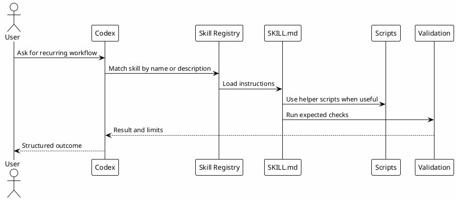

# 09 - Skills

## In One Sentence

Skills turn a recurring way of working into a reusable procedure.

## What You Will Understand

By the end of this page, you should be able to create a simple skill, install a shared skill and explain how it enters the workflow.

## Summary

Skills are reusable workflows stored at `~/.codex/skills/<name>/SKILL.md`.

A skill should explain:

- when to use it;
- what steps to follow;
- what evidence to gather;
- when to stop;
- what output is expected;
- what references help.

## Flow



## How To Think About A Skill

Ask:

1. When should this workflow be used?
2. What steps are repeated?
3. Which files, scripts or references help?
4. How do we know it finished correctly?
5. What should the final output contain?

If you cannot answer these questions, it may be too early to create a skill.

## Local Configuration Steps

1. Create `~/.codex/skills/<skill-name>`.
2. Add a `SKILL.md`.
3. Define `name` and `description` in frontmatter.
4. Write when to use it, steps, rules and expected output.
5. Put scripts in `scripts/` only when repetition is mechanical.
6. Test the skill with a small request before relying on it daily.

Templates:

- [Download example-skill-SKILL.md](templates/skills-downloads/example-skill-SKILL.md)
- [Download study-SKILL.md](templates/skills-downloads/study-SKILL.md)
- [Download feature-dev-SKILL.md](templates/skills-downloads/feature-dev-SKILL.md)
- [Download investigation-SKILL.md](templates/skills-downloads/investigation-SKILL.md)
- [Download codereview-SKILL.md](templates/skills-downloads/codereview-SKILL.md)
- [Download session-memory-SKILL.md](templates/skills-downloads/session-memory-SKILL.md)

```bash
mkdir -p ~/.codex/skills/example-workflow
$EDITOR ~/.codex/skills/example-workflow/SKILL.md
```

## When To Use

Use a skill when the same workflow repeats often enough that the steps, evidence and output format should be predictable.

Do not create a skill for a one-off task.

## Steps

A minimal skill usually contains:

```markdown
---
name: example-workflow
description: Use this skill when a recurring local workflow needs the same steps and checks every time.
---

# Example Workflow

## When To Use

Use this skill for a repeated workflow with stable steps.

## Steps

1. Gather focused context.
2. Execute the local workflow.
3. Validate the result.
4. Return changed files, checks and remaining risk.
```

To install the starter pack after downloading templates:

```bash
mkdir -p ~/.codex/skills/study ~/.codex/skills/feature-dev ~/.codex/skills/investigation
mkdir -p ~/.codex/skills/codereview ~/.codex/skills/session-memory
cp study-SKILL.md ~/.codex/skills/study/SKILL.md
cp feature-dev-SKILL.md ~/.codex/skills/feature-dev/SKILL.md
cp investigation-SKILL.md ~/.codex/skills/investigation/SKILL.md
cp codereview-SKILL.md ~/.codex/skills/codereview/SKILL.md
cp session-memory-SKILL.md ~/.codex/skills/session-memory/SKILL.md
```

## Shared Starter Pack

| Skill | Purpose | Needs adaptation |
|---|---|---|
| `study` | Research before uncertain implementation. | Sources and planning format. |
| `feature-dev` | Implementation from a clear plan. | Project validation commands. |
| `investigation` | Evidence-based investigation. | Approved sources, logs and MCPs. |
| `codereview` | Risk and regression review. | Team checklist and severities. |
| `session-memory` | Durable memory and handoff. | Vault or notes path. |

## Why It Works

Skills transform operational practice into procedure. They reduce improvisation and make recurring work easier to inspect.

## Common Mistakes

- Creating a skill for a task that happened once.
- Writing a vague `description`. The description helps Codex know when to load the skill.
- Putting huge documentation into the main `SKILL.md`; long references should live in auxiliary files.
- Forgetting to test the skill with a small request before using it in real work.

## Knowledge Reuse

Skills are major consumers of the knowledge loop:

- they read gotchas;
- consult review learnings;
- use business rules;
- recover Session-Memory;
- apply runbooks;
- generate findings that can go back into the vault.

## Checkpoint

```bash
rtk proxy find ~/.codex/skills -maxdepth 2 -name SKILL.md -print
rtk sed -n '1,80p' ~/.codex/skills/session-memory/SKILL.md
rtk rg -n '^name:|^description:' ~/.codex/skills -g 'SKILL.md'
rtk rg -n 'YOUR_|REPLACE_ME|TODO' ~/.codex/skills -g 'SKILL.md'
```

You should be able to explain why a skill exists and what signal proves it was used.

## Next Module

Go to [[09-local-configuration-hands-on]].
