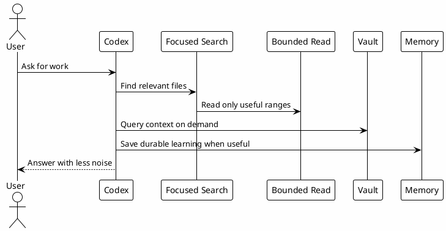

# 10 - Token Economy

## In One Sentence

Token Economy means using session context carefully so Codex reads what matters, not everything that exists.

## What You Will Understand

By the end of this page, you should understand why focused commands, on-demand search and durable memory improve answer quality.

## Summary

Token Economy is a set of practices that reduces useless output and preserves context for important reasoning.

The goal is not cost reduction for its own sake. The goal is to avoid logs, diffs and large files pushing useful context out of the session.

## Core Practices

| Practice | Meaning |
|---|---|
| focused search | Use `rg` and scoped paths before broad reads. |
| bounded output | Prefer `sed -n`, `nl -ba`, `--stat` and JSON filters. |
| on-demand context | Query vault, docs or MCPs when needed instead of pasting everything. |
| compact skills | Load references only when relevant. |
| durable memory | Save reusable learning outside the chat. |

## Diagram



## Why It Works

The session context is a limited resource. Useful evidence should stay visible; noisy output should stay out.

## Mechanisms

- Use `rg` and bounded reads instead of dumping large files.
- Fetch context on demand from MCPs and vault.
- Save durable learning instead of repeating it in every prompt.
- Keep skills concise and move long references into separate files.

## Simple Example

Instead of pasting a whole repository into the prompt, ask Codex to find the relevant files:

```text
Find where this workflow is implemented. Use rg first, read only the smallest relevant files, then explain what evidence you found.
```

## Common Mistakes

- Pasting huge files before knowing whether they matter.
- Running broad recursive reads.
- Keeping outdated memory in the active prompt.
- Using agents when a focused local read is enough.

## Checkpoint

You should be able to explain why `rg`, bounded file reads and vault search are better defaults than dumping entire directories into the session.

## Next Module

Go to [[11-vault-and-memory]].
