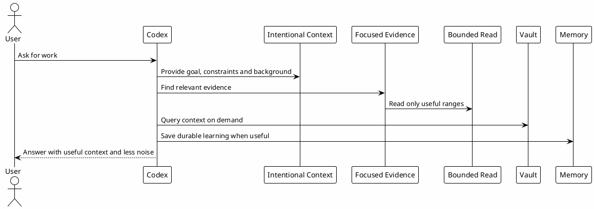

# 10 - Token Economy

## In One Sentence

Token Economy means using context intentionally so Codex keeps the right evidence visible.

## What You Will Understand

By the end of this page, you should understand when long context helps, when noisy output hurts and how to keep evidence useful across a session.

## Summary

Token Economy is not about being afraid of the context window.

Codex can work well in long, durable threads. The goal is to make sure the thread is filled with useful context, not accidental noise.

The practical rule is simple: give Codex enough context to reason well, and avoid unbounded output that does not help the task.

## Core Practices

| Practice | Meaning |
|---|---|
| Intentional context | Include background, constraints, examples and goals when they help Codex reason. |
| Focused evidence | Use `rg`, scoped paths and MCPs to find the relevant source quickly. |
| Bounded output | Prefer `sed -n`, `nl -ba`, `--stat` and JSON filters for noisy commands. |
| Durable threads | Keep a useful thread going when it is building shared context. |
| Durable memory | Save reusable learning outside the chat when it should survive this session. |

## Diagram



## Why It Works

The context window is valuable because it lets Codex retain a lot of working knowledge.

The risk is not "too many tokens" by itself. The risk is filling the thread with output that makes the important evidence harder to find.

## Mechanisms

- Use long prompts when they carry useful background.
- Use `rg` and bounded reads for noisy source exploration.
- Fetch context on demand from MCPs and vault when the answer depends on prior knowledge.
- Keep a durable thread when the work benefits from accumulated context.
- Save reusable learning when another session should find it later.

## Simple Example

Instead of asking for a vague fix, give enough context and ask Codex to find the evidence:

```text
I am investigating why this validation flow behaves differently in one service. Start by finding the relevant implementation and tests, use focused reads for evidence, then explain the smallest safe validation step.
```

This is not shorter. It is better context.

## Common Mistakes

- Treating token economy as "always be short".
- Running commands that produce pages of unrelated logs.
- Keeping stale assumptions in the active thread after evidence changes.
- Using subagents when a focused local read is enough.

## Checkpoint

You should be able to explain when more context helps and when bounded reads keep the thread cleaner.

## Next Module

Go to [[11-vault-and-memory]].
