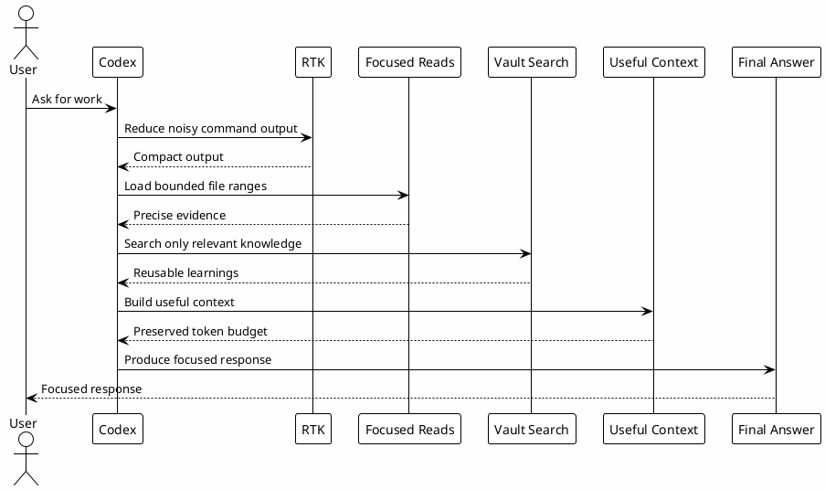

# 10 - Token Economy

## Em uma frase

Token Economy é usar o contexto da sessão com cuidado para que o Codex leia o que importa, não tudo que existe.

## O que você vai entender

Ao final desta página, você deve conseguir explicar por que comandos focados, busca sob demanda e memória durável melhoram a qualidade da resposta.

## Resumo

Token Economy é o conjunto de práticas que reduz output inútil e preserva contexto para raciocínio importante.

O objetivo não é economizar por economizar. É evitar que logs, diffs e arquivos grandes empurrem contexto útil para fora da sessão.

## Diagrama



## Mecanismos

| Mecanismo | Papel |
|---|---|
| `rtk` | Filtra comandos ruidosos e mede economia. |
| leituras limitadas | Usa `sed -n`, `rg`, `nl` e paths específicos. |
| hooks | Bloqueiam comandos ruidosos sem `rtk`. |
| MCP analytics | Mede output grande de MCP. |
| skills compactas | Carrega referências só quando necessário. |
| Session-Memory | Persiste resumo operacional em vez de manter tudo no contexto. |
| agents limitados | Evita fan-out caro sem ganho real. |

## Por que funciona

O contexto da sessão é recurso limitado.

Comandos como `git diff`, `gh pr diff`, builds e logs podem gerar milhares de linhas. `rtk` e leituras focadas preservam o contexto para decisões.

## Exemplo simples

Em vez de pedir "leia todo o repo", prefira:

```bash
rtk rg -n 'termo-importante' src tests
rtk sed -n '1,160p' src/arquivo-relevante.ts
```

Isso entrega evidência suficiente sem transformar a sessão em um despejo de texto.

## Checkpoints

```bash
rtk --version
rtk gain
rtk rg -n 'pattern' path
rtk sed -n '1,120p' file.md
```

Use `rtk proxy` quando precisar de output bruto:

```bash
rtk proxy find ~/.codex/hooks -maxdepth 1 -type f -print
```

## Erros comuns

- usar `cat` em arquivo grande;
- colar contexto enorme inline;
- rodar `gh pr diff` completo;
- rodar suite inteira antes de teste focado;
- carregar todas as referências de uma skill sem necessidade.
- economizar tanto que falta evidência. Economia de tokens não significa remover contexto essencial.

## Próximo Módulo

Siga para [[11-vault-and-memory]].
