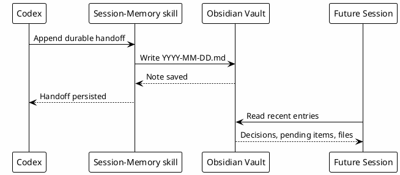

# 11 - Vault and Memory

## Em uma frase

Vault guarda conhecimento durável, Session-Memory guarda continuidade operacional entre sessões.

## O que você vai entender

Ao final desta página, você deve saber quando escrever uma nota permanente e quando salvar apenas um handoff de sessão.

## Resumo

O Obsidian vault é a base operacional do trabalho. Session-Memory é o mecanismo append-only para continuidade entre sessões.

## Papel do vault

O vault guarda:

- planos;
- investigações;
- runbooks;
- business rules;
- review learnings;
- dailies;
- prompts;
- conhecimento consolidado;
- Session-Memory.

## Papel da Session-Memory

Session-Memory registra o que precisa sobreviver:

- o que foi feito;
- decisões;
- pendências;
- arquivos modificados;
- validações;
- links de PR/ticket quando relevantes;
- blockers.

Não deve guardar:

- ruído;
- segredos;
- logs enormes;
- conversa casual;
- output bruto de comando.

## Por que funciona

O modelo perde contexto entre sessões ou compaction. Session-Memory cria continuidade operacional sem manter tudo no prompt.

## Como Decidir Onde Salvar

| Informação | Melhor lugar |
|---|---|
| Decisão temporária, arquivos modificados, próximo passo | Session-Memory. |
| Runbook que será usado por várias pessoas | Vault em `Runbooks/`. |
| Regra de negócio durável | Knowledge-Base. |
| Gotcha encontrado em review | Review-Learnings ou Knowledge-Base. |
| Log bruto grande | Não salvar bruto, resumir ou linkar fonte segura. |

## Erros comuns

- Salvar segredo em memória.
- Salvar tudo que aconteceu, inclusive ruído.
- Tratar Session-Memory como documentação final.
- Esquecer de atualizar handoff quando uma tarefa longa mudou de estado.

## Fluxo



## Checkpoint

```bash
rtk python3 ~/.codex/skills/session-memory/scripts/session_memory.py read --days 3
rtk proxy find 'Luxury-Escapes/Knowledge-Base/Session-Memory' -maxdepth 1 -name '2026-*.md' -print
```

## Próximo Módulo

Siga para [[12-local-knowledge-base]].
