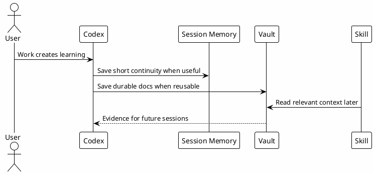

# 11 - Vault and Memory

## In One Sentence

The vault stores reusable knowledge, while Session-Memory preserves intentional continuity between Codex sessions.

## What You Will Understand

By the end of this page, you should know the difference between chat history, Session-Memory, vault docs and an indexed knowledge base.

## Summary

Not every useful fact belongs in the prompt, and not every useful fact deserves a permanent document.

Think about the layers this way:

| Layer | Scope | Best use |
|---|---|---|
| Chat history | Current conversation. | Active reasoning, recent tool output and immediate decisions. |
| Session-Memory | Explicit handoff across sessions. | What changed, what was decided, where to resume and what remains pending. |
| Vault docs | Durable knowledge across many sessions. | Runbooks, gotchas, architecture notes, setup guides and review learnings. |
| Indexed KB | Optional search layer over durable knowledge. | Letting MCPs retrieve the right vault content without loading the whole vault. |

Use Session-Memory for short continuity:

- current task status;
- decisions taken today;
- changed files;
- pending actions;
- short handoff context.

Use durable vault docs for reusable knowledge:

- runbooks;
- architecture decisions;
- gotchas;
- review learnings;
- reusable setup guides.

## Diagram

## Why It Works

Memory makes future sessions less dependent on human recall. The key is to save only what will help later and avoid secrets or noise.

Chat history and compaction are useful, but they are not the same as an intentional handoff. Session-Memory says: "if another session starts later, this is the minimum context needed to resume safely."

## Role of the Vault

The vault is durable documentation. It holds runbooks, architecture notes, feature plans, review learnings, gotchas and operational context.

The vault is not tied to one chat thread. Any future session can benefit from it when the content is searchable or linked from the right workflow.

## Role of Session-Memory

Session-Memory is continuity. It captures what changed, what was decided, what remains pending and where to resume.

It is intentionally smaller than the vault. It should not become a second documentation system.

Session-Memory is useful when:

- a task is not finished;
- a decision affects the next session;
- a file or branch state matters for resuming;
- the next assistant needs a short handoff before reading the repo again.

It is not useful for:

- stable runbooks;
- long architecture explanations;
- secrets;
- generic notes that no future session needs.

## Why Not Just Rely on Chat History?

Chat history is excellent while the conversation is active. Long Codex threads can work well, and compaction keeps improving.

Session-Memory still has value because it is intentional and portable:

- it can be read before the next session starts real work;
- it can point to files, branches, decisions and pending actions;
- it can survive when the relevant context is buried deep in a long thread;
- it can bridge work across different sessions.

The goal is not to duplicate the chat. The goal is to write a concise handoff when the state is worth preserving.

## How It Relates to the Indexed KB

Session-Memory and vault docs are source material. The optional indexed knowledge base makes that material searchable through `local-le-vault`.

That means:

- Session-Memory can preserve short continuity.
- Vault docs can preserve reusable knowledge.
- The indexed KB can retrieve either one when it has been indexed.
- Codex still needs to validate current code and current facts before acting.

## How to Decide Where to Save

| Information | Best place |
|---|---|
| Today's pending work | Session-Memory |
| Stable setup guide | Documentation |
| Repeated pitfall | Gotcha or review learning |
| Operational procedure | Runbook |
| Reusable workflow | Skill |
| Current conversation reasoning | Chat history |

## Common Mistakes

- Saving secrets in memory.
- Saving temporary noise as durable knowledge.
- Treating old memory as current evidence.
- Putting stable documentation only in Session-Memory.
- Copying the whole chat into Session-Memory instead of writing a handoff.

## Checkpoint

You should be able to classify an item as chat history, Session-Memory, durable vault documentation or indexed knowledge.

## Next Module

Go to [[12-local-knowledge-base]].
