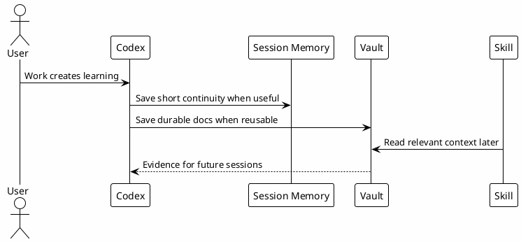

# 11 - Vault And Memory

## In One Sentence

The vault stores durable operational context, while session memory preserves continuity between Codex sessions.

## What You Will Understand

By the end of this page, you should know when information belongs in Session-Memory and when it should become a more durable document.

## Summary

Not every useful fact belongs in the prompt. Durable information should live where future sessions can find it.

Use Session-Memory for:

- current task status;
- decisions taken today;
- changed files;
- pending actions;
- short handoff context.

Use durable vault docs for:

- runbooks;
- architecture decisions;
- gotchas;
- review learnings;
- reusable setup guides.

## Diagram

## Why It Works

Memory makes future sessions less dependent on human recall. The key is to save only what will help later and avoid secrets or noise.

## Checkpoint

You should be able to classify an item as temporary, Session-Memory or durable documentation.

## Next Module

Go to [[12-local-knowledge-base]].
