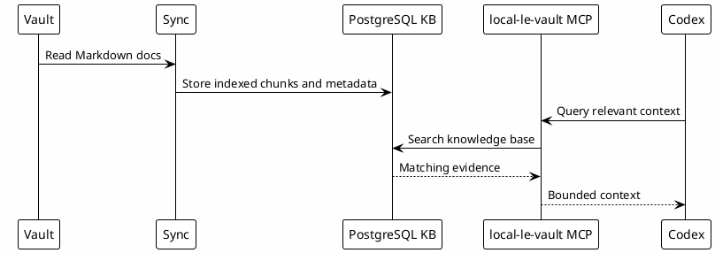

# 12 - Local Knowledge Base

## In One Sentence

The optional local knowledge base indexes durable documents so Codex can search evidence instead of relying on memory alone.

## What You Will Understand

By the end of this page, you should understand when this optional layer is useful and how vault content becomes searchable through PostgreSQL and MCP tooling.

## Summary

The vault is the source of curated Markdown knowledge. PostgreSQL can store indexed chunks, metadata and search structures when local indexed retrieval is enabled. The MCP layer exposes that knowledge to Codex.

This turns past work into searchable evidence.

This page explains the mental model behind the optional `local-le-vault` integration introduced in [[09-external-apps-and-services]] and connected in [[09-mcp-and-connectors-setup]].

If the learner already completed [[00-apps-environment-setup]], use this page to understand and validate the system. If they skipped that optional setup, read this page conceptually and keep PostgreSQL, pgvector and Ollama disabled until local indexed retrieval is actually needed.

## Flow



## Why It Works

Codex does not need every document in the prompt. It needs the right document at the right time.

## Safety

Do not publish connection strings, usernames, passwords, internal hosts or private wrapper paths. Public templates should use placeholders.

## Role in the Ecosystem

The local knowledge base makes the vault searchable through an MCP. It helps Codex find prior context without loading the whole vault into the prompt.

## How It Works

1. Markdown and operational notes are indexed.
2. Ollama generates embeddings for the indexed content.
3. PostgreSQL stores searchable content, metadata and vectors.
4. `local-le-vault` receives a query from Codex.
5. The MCP generates a query embedding and searches PostgreSQL.
6. The MCP returns focused evidence.
7. Codex uses that evidence with current validation.

## Minimum Local Requirements

This setup is optional. It is needed only for `local-le-vault` with indexed local retrieval.

That path needs:

| Requirement | Purpose |
|---|---|
| Markdown or Obsidian vault | Source of durable notes, runbooks, gotchas and Session-Memory. |
| PostgreSQL | Stores indexed knowledge rows. |
| pgvector | Stores and searches vector embeddings. |
| Ollama | Runs the local embedding model. |
| `nomic-embed-text` | Embedding model used by the knowledge search flow. |
| `local-le-vault` MCP server script | Exposes `query_vault` and source discovery to Codex. |
| MCP wrapper | Starts the server with the correct environment variables. |
| Local secrets file | Keeps database URLs and tokens out of public templates. |

## Configuration Shape

The public workbook should not include a real personal path or real database URL.

The learner should fill these values in the template variables step:

- vault path;
- PostgreSQL URL;
- local path to the `local-le-vault` MCP server;
- local path to the wrapper inside `~/.codex/hooks`;
- optional service names or filters used by their team.

The wrapper then sets the database connection and starts the MCP server.

## Files Involved

Typical pieces are:

- vault Markdown files;
- indexing scripts;
- PostgreSQL database;
- Ollama embedding model;
- MCP wrapper;
- local credentials file ignored by Git.

## Validation Steps

Run small checks before relying on the knowledge base:

```bash
pg_isready -h localhost -p YOUR_POSTGRES_PORT
ollama list | rg nomic-embed-text
codex mcp get local-le-vault
```

Then ask Codex a scoped question that should be present in the vault. If the answer is generic or empty, check whether the source was indexed and whether the `service_filter` is too narrow.

## What Can Be Confusing

The database is not the source of truth. The source of truth is still the curated documents. PostgreSQL is the indexed retrieval layer.

## Common Mistakes

- Saving secrets in indexed notes.
- Assuming search results are always complete.
- Forgetting to re-index after major document changes.
- Using stale knowledge without checking current code.
- Configuring the MCP wrapper before PostgreSQL and Ollama are running, when this optional path is enabled.
- Using a private absolute path from another developer's machine.

## Checkpoint

You should be able to explain:

- what the vault stores;
- why PostgreSQL is used;
- what the MCP exposes;
- why secrets stay outside public templates.

## Next Module

Go to [[13-knowledge-reuse-loop]].
