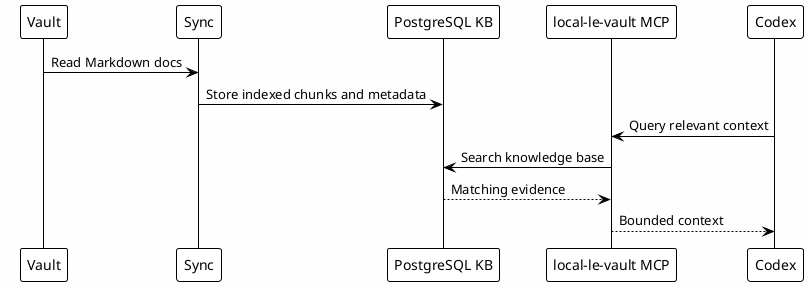

# 12 - Local Knowledge Base

## In One Sentence

The local knowledge base indexes durable documents so Codex can search evidence instead of relying on memory alone.

## What You Will Understand

By the end of this page, you should understand how vault content becomes searchable through PostgreSQL and MCP tooling.

## Summary

The vault is the source of curated Markdown knowledge. PostgreSQL can store indexed chunks, metadata and search structures. The MCP layer exposes that knowledge to Codex.

This turns past work into searchable evidence.

## Flow

## Why It Works

Codex does not need every document in the prompt. It needs the right document at the right time.

## Safety

Do not publish connection strings, usernames, passwords, internal hosts or private wrapper paths. Public templates should use placeholders.

## Role In The Ecosystem

The local knowledge base makes the vault searchable through an MCP. It helps Codex find prior context without loading the whole vault into the prompt.

## How It Works

1. Markdown and operational notes are indexed.
2. PostgreSQL stores searchable content and metadata.
3. `local-le-vault` receives a query from Codex.
4. The MCP returns focused evidence.
5. Codex uses that evidence with current validation.

## Files Involved

Typical pieces are:

- vault Markdown files;
- indexing scripts;
- PostgreSQL database;
- MCP wrapper;
- local credentials file ignored by Git.

## What Can Be Confusing

The database is not the source of truth. The source of truth is still the curated documents. PostgreSQL is the indexed retrieval layer.

## Common Mistakes

- Saving secrets in indexed notes.
- Assuming search results are always complete.
- Forgetting to re-index after major document changes.
- Using stale knowledge without checking current code.

## Checkpoint

You should be able to explain:

- what the vault stores;
- why PostgreSQL is used;
- what the MCP exposes;
- why secrets stay outside public templates.

## Next Module

Go to [[13-knowledge-reuse-loop]].
