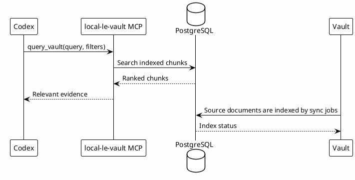

# 12 - Local Knowledge Base

## Em uma frase

`local-le-vault` permite que o Codex pesquise conhecimento do vault sem colar documentos inteiros no prompt.

## O que você vai entender

Ao final desta página, você deve conseguir explicar a relação entre Obsidian, PostgreSQL e o MCP local.

## Resumo

`local-le-vault` é o MCP que consulta a base de conhecimento Luxury Escapes local.

Ele usa um backend PostgreSQL com conhecimento indexado para responder perguntas com contexto de business rules, runbooks, pitfalls, review learnings, Confluence e Session-Memory.

## Papel no Ecossistema

O MCP existe para evitar busca manual ampla.

Antes de editar código ou tomar decisão LE, o Codex consulta conhecimento já aprendido:

- regras de negócio;
- incidentes;
- gotchas;
- reviews anteriores;
- runbooks;
- docs sincronizadas.

## Como Funciona



## Arquivos Envolvidos

| Item | Papel |
|---|---|
| `~/.codex/config.toml` | Registra o MCP server. |
| `~/.codex/hooks/mcp-local-le-vault-wrapper.sh` | Inicializa o servidor MCP local. |
| `svc-radar-dashboard/automations/vault/vault_mcp_server.py` | Implementa o MCP. |
| PostgreSQL local | Guarda a base indexada. |
| Obsidian vault | Fonte primária de documentos. |

## Nota de Segurança

Não publique connection strings, usuário, senha, host interno ou paths privados do wrapper. Para o workbook público, use placeholders.

## O que pode gerar dúvida

| Dúvida | Resposta curta |
|---|---|
| O vault substitui o banco? | Não. O vault é fonte humana. PostgreSQL é o índice pesquisável. |
| O banco substitui os docs? | Não. Ele ajuda a recuperar trechos relevantes. |
| Preciso de PostgreSQL para estudar conceitos? | Não. Ele entra quando a pessoa montar a knowledge base local. |
| A resposta do MCP é sempre verdade atual? | Não. Precisa considerar data, fonte e possível desatualização. |

## Erros comuns

- Indexar conteúdo privado e depois publicar exemplos sem sanitizar.
- Consultar a base com query vaga demais.
- Aceitar resultado antigo sem verificar se o contexto mudou.
- Confundir falha vazia com erro. Resultado vazio pode apenas indicar que não há chunk relevante.

## Checkpoint

No runtime Codex, valide com uma query simples:

```text
query_vault: "pitfalls codex workflow local-le-vault"
```

O resultado esperado é uma resposta vazia ou chunks relevantes. Ambos são válidos. Falha de conexão indica problema no MCP ou PostgreSQL local.

## Próximo Módulo

Siga para [[13-knowledge-reuse-loop]].
