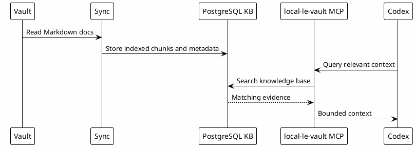

# 12 - Local Knowledge Base

## In One Sentence

The local knowledge base indexes durable documents so Codex can search evidence instead of relying on memory alone.

## What You Will Understand

By the end of this page, you should understand how vault content becomes searchable through PostgreSQL and MCP tooling.

## Summary

The vault is the source of curated Markdown knowledge. PostgreSQL can store indexed chunks, metadata and search structures. The MCP layer exposes that knowledge to Codex.

This turns past work into searchable evidence.

## Flow

## Why It Works

Codex does not need every document in the prompt. It needs the right document at the right time.

## Safety

Do not publish connection strings, usernames, passwords, internal hosts or private wrapper paths. Public templates should use placeholders.

## Checkpoint

You should be able to explain:

- what the vault stores;
- why PostgreSQL is used;
- what the MCP exposes;
- why secrets stay outside public templates.

## Next Module

Go to [[13-knowledge-reuse-loop]].
