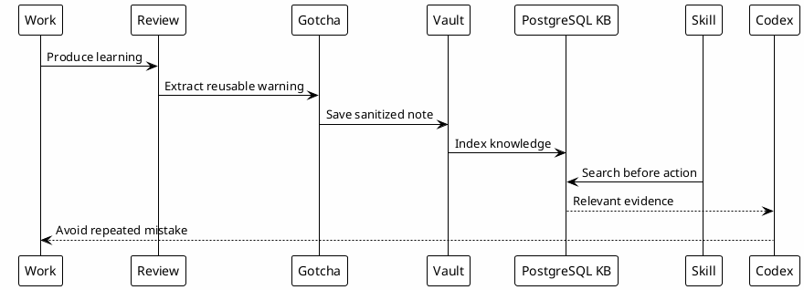

# 13 - Knowledge Reuse Loop

## In One Sentence

Reuse happens when today's learning becomes findable evidence for a future session.

## What You Will Understand

By the end of this page, you should be able to turn a review, gotcha or decision into reusable knowledge.

## Summary

The point of the ecosystem is to turn real work into reusable knowledge.

Information created by investigations, Confluence sync, code reviews, gotchas, runbooks and Session-Memory returns to the knowledge base. Later, skills and MCPs can use it before acting.

This is the difference between one-time training and living onboarding.

## Flow



## Reusable Sources

| Source | Reusable value |
|---|---|
| Session-Memory | Continuity, pending actions and decisions. |
| Code reviews | Regressions, risk patterns and missed tests. |
| Confluence | Team docs and durable decisions. |
| Business rules | Rules that prevent wrong implementation. |
| Pitfalls | Known mistakes and prevention. |
| Investigations | Root cause, evidence and diagnosis. |

## Why It Works

Each session improves the next one. The value does not come from one answer, but from controlled accumulation of knowledge.

## Reusable Gotcha Example

A code review finds this issue:

```text
When changing a filter flow, validate both directions: applying the filter before selecting an item, and selecting the item before applying the filter.
```

That should become reusable knowledge because the next similar task can find it before repeating the mistake.

## Common Mistakes

- Leaving review learnings only inside a closed PR.
- Saving every comment instead of extracting the reusable lesson.
- Writing gotchas without domain, symptom or validation signal.
- Forgetting to update stale gotchas when behavior changes.

## Checkpoint

A piece of information became reusable knowledge when it:

- was written in a durable place;
- was sanitized;
- has enough context to be found later;
- can be used by a skill before action.

## Next Module

Go to [[14-automation-sync]].
