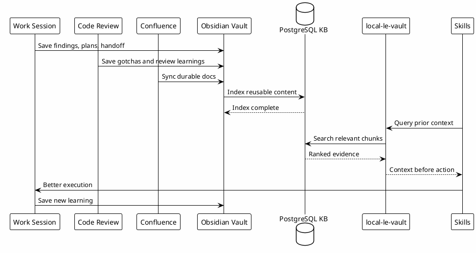

# 13 - Knowledge Reuse Loop

## Em uma frase

O reuso acontece quando um aprendizado de hoje vira evidência encontrável para uma sessão futura.

## O que você vai entender

Ao final desta página, você deve conseguir transformar um review, gotcha ou decisão em conhecimento reutilizável.

## Resumo

O ponto central do ecossistema é transformar trabalho real em conhecimento reutilizável.

Informação gerada por investigações, sincronizações, Confluence, codereviews, gotchas, runbooks e Session-Memory volta para a base. Depois, as skills usam esse conhecimento em novas sessões.

Essa é a diferença entre treinamento pontual e onboarding vivo. O material não termina quando a pessoa leu a página. Cada review, investigação e aprendizado pode alimentar a próxima execução do workflow.

## Fluxo

## Fontes de Conhecimento

| Fonte | Tipo de reuso |
|---|---|
| Session-Memory | Continuidade, pendências, decisões. |
| Codereviews | Gotchas, regressions, test gaps, quality patterns. |
| Confluence | Docs de equipe e decisões duráveis. |
| Runbooks | Procedimentos operacionais. |
| Business-Rules | Regras que impedem implementações erradas. |
| Pitfalls | Erros conhecidos e prevenção. |
| Investigações | Causa raiz, evidência e diagnóstico. |

## Por que funciona

Cada sessão melhora a próxima. O ganho não vem de uma resposta isolada, mas da acumulação controlada de conhecimento.

O ciclo evita:

- redescobrir pitfalls;
- repetir bugs já encontrados em review;
- ignorar regras de negócio conhecidas;
- perder decisões em conversas antigas;
- depender de memória humana para tudo.

## Exemplo de gotcha reutilizável

Aprendizado bruto: "O build quebrou porque alguém usou API antiga".

Conhecimento reutilizável:

- qual API antiga causou o problema;
- onde a API nova está documentada;
- como detectar o padrão com `rg`;
- qual teste ou build confirma a correção;
- qual skill deve consultar esse gotcha antes de editar area parecida.

## Erros comuns

- Salvar conclusão sem evidência.
- Salvar gotcha sem indicar como encontrar o problema de novo.
- Escrever conhecimento tão específico que não ajuda outra sessão.
- Deixar o aprendizado apenas na conversa temporária.

## Checkpoint

Uma informação virou conhecimento reutilizável quando:

- foi escrita em local durável;
- está sanitizada;
- possui contexto suficiente para ser entendida depois;
- pode ser encontrada por busca vault ou `local-le-vault`;
- uma skill consegue usar a informação antes de agir.

## Próximo Módulo

Siga para [[14-automation-sync]].
