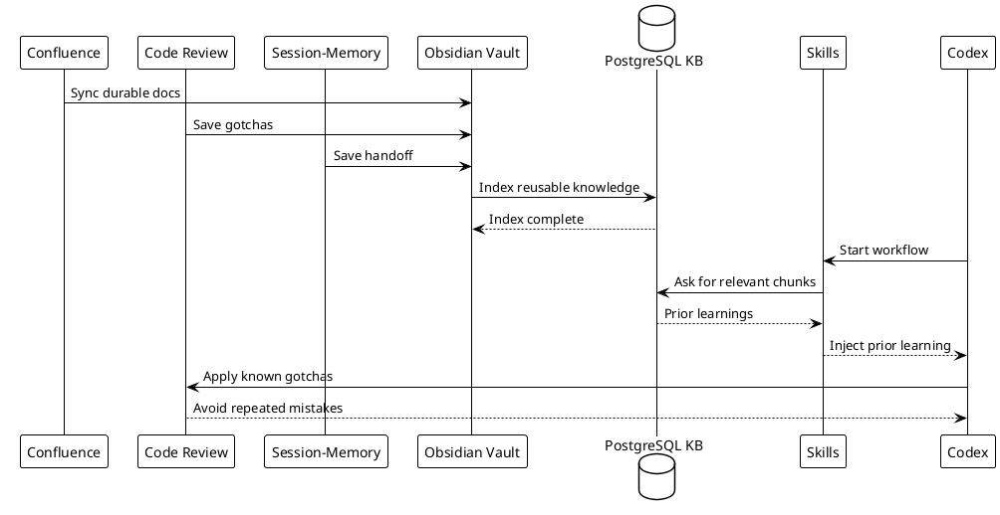

# 14 - Automation Sync

## Em uma frase

Automações mantêm o conhecimento atualizado para que skills e MCPs encontrem o que foi aprendido.

## O que você vai entender

Ao final desta página, você deve conseguir explicar quais informações podem ser sincronizadas e por que nem tudo deve virar automação.

## Resumo

Automações mantêm o conhecimento vivo.

Elas reduzem trabalho manual para sincronizar, resumir, indexar e recuperar informações usadas depois pelo Codex, por skills e por MCPs.

## Diagrama



## Tipos de Automação

| Tipo | Papel |
|---|---|
| Session autosave | Salva resumo de sessão quando possível. |
| Confluence sync | Traz docs duráveis para o vault. |
| Vault indexing | Atualiza PostgreSQL usado pelo `local-le-vault`. |
| MCP output analytics | Mede custo de chamadas MCP. |
| Domain context | Injeta contexto por workspace e prompt. |
| Radar/local automations | Podem gerar digests, knowledge packs e reports. |

## Por que funciona

O conhecimento só é reutilizável se estiver atualizado e encontrável.

Automação fecha a distância entre:

- informação criada;
- informação salva;
- informação indexada;
- informação recuperada por uma skill.

## O que automatizar primeiro

Priorize automações que:

- reduzem repetição manual clara;
- geram conhecimento durável;
- não dependem de segredo publicado;
- podem ser validadas com output pequeno;
- falham de forma diagnosticável.

Não automatize processo que ainda muda todos os dias. Primeiro estabilize o workflow.

## Relação Com Hooks

Algumas automações entram via hooks:

- `SessionStart` verifica ambiente;
- `SessionEnd` tenta salvar handoff;
- `PostToolUse` registra uso;
- `mcp-output-analytics` registra custo.

Outras entram via scripts externos ou projetos auxiliares, como automações do Radar.

## Erros comuns

- Automatizar antes de entender o fluxo manual.
- Sincronizar conteúdo privado sem sanitização.
- Indexar documento sem metadado ou título claro.
- Criar automação que falha silenciosamente.

## Checkpoint

Verifique:

```bash
rtk proxy find ~/.codex/hooks -maxdepth 1 -type f -print
rtk rg -n 'Session-Memory|local-le-vault|knowledge|Confluence|sync' Luxury-Escapes/Knowledge-Base ~/.codex/hooks ~/.codex/skills -g '*.md' -g '*.py' -g '*.sh'
```

## Próximo Módulo

Siga para [[15-checkpoints]].
