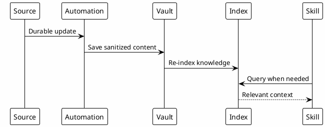

# 14 - Automation Sync

## In One Sentence

Automations keep knowledge current so skills and MCPs can find what has been learned.

## What You Will Understand

By the end of this page, you should understand which information can be synchronized and why not everything should become automation.

## Summary

Automations keep knowledge alive.

They reduce manual work for syncing, summarizing, indexing and retrieving information used later by Codex, skills and MCPs.

## Flow

## Automation Types

| Automation | Purpose |
|---|---|
| Session autosave | Saves session summaries when useful. |
| Confluence sync | Brings durable docs into the vault. |
| Review export | Turns reviews into learnings and gotchas. |
| Index refresh | Keeps the local knowledge base searchable. |

## Why It Works

Knowledge is reusable only when it is current and findable.

Automation closes the gap between information being created, saved, indexed and retrieved by a skill.

## When to Automate

Prioritize automations that:

- reduce clear manual repetition;
- create durable knowledge;
- do not depend on published secrets;
- fail in a diagnosable way.

Do not automate a process that still changes every day. Stabilize the workflow first.

## What to Automate First

Automate the boring and repeatable parts first:

- syncing durable Confluence pages;
- exporting review learnings;
- indexing vault content;
- saving session handoffs;
- validating docs and template safety.

## Relationship With Hooks

Hooks are runtime automation inside Codex sessions. Sync jobs are broader automation that keep external sources and local knowledge aligned.

## Common Mistakes

- Automating before the manual process is understood.
- Syncing noisy or low-quality content.
- Copying private data into public docs.
- Assuming automation removes the need for review.

## Checkpoint

You should be able to name one source that can feed reusable knowledge and explain how it becomes searchable.

## Next Module

Go to [[15-checkpoints]].
