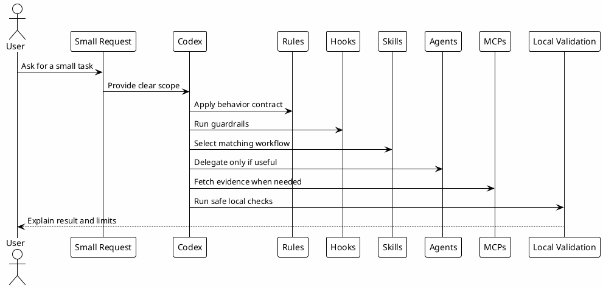

# 15 - Primeira Tarefa Guiada

## Em uma frase

A primeira tarefa guiada transforma o setup em evidência prática: você observa o Codex usando contexto, regras, skills, agents, hooks e MCPs em um pedido pequeno.

## O que você vai entender

Ao final desta página, você deve conseguir sair do modo "instalei arquivos" e entrar no modo "sei observar se o ambiente refletiu no workflow".

## Resumo

O objetivo desta etapa não é fazer uma entrega grande.

O objetivo é executar uma tarefa pequena, segura e verificável. Ela deve ser simples o suficiente para não depender de deploy, PR, Slack, Jira, produção ou dado sensível.

Use esta página como um ensaio antes de depender do ambiente em trabalho real.

## Antes de começar

Escolha um repositório ou pasta de estudo onde você pode ler arquivos sem risco.

Não use uma tarefa que precise:

- modificar produção;
- fazer push;
- abrir PR;
- enviar mensagem externa;
- acessar segredo;
- rodar migração;
- publicar o playbook.

O primeiro teste deve ser read-only ou, no máximo, uma alteração local descartável.

## Diagrama



## Tarefa 1 - Orientação Read-only

Abra o Codex dentro de um repositório local e peça:

```text
Me ajude a entender este projeto. Primeiro leia apenas arquivos de orientação, scripts e estrutura de pastas. Depois explique qual stack parece ser usada, quais comandos de validação existem e quais arquivos eu deveria ler antes de mudar código.
```

Resultado esperado:

- o Codex começa por leitura local, não por suposição;
- usa comandos com saída controlada;
- identifica scripts de install, lint, test ou build quando existirem;
- aponta limites do que ainda não foi verificado;
- não altera arquivos.

Camadas observadas:

| Camada | O que observar |
|---|---|
| Rules | Resposta direta, escopo claro e sem mutação externa. |
| Hooks | Comandos ruidosos ou perigosos devem ser orientados ou bloqueados. |
| Token Economy | Leitura focada, sem dump recursivo do repo. |
| Agents | Não devem ser usados se a tarefa for simples. |

## Tarefa 2 - Investigação Pequena

Depois peça:

```text
Me ajude a investigar onde este projeto define os comandos de validação local. Traga evidência dos arquivos lidos e diga qual comando eu deveria rodar primeiro.
```

Resultado esperado:

- resposta com evidência de arquivos;
- recomendação de um primeiro comando seguro;
- explicação do motivo;
- nenhum comando destrutivo.

Camadas observadas:

| Camada | O que observar |
|---|---|
| Skills | Se existir uma skill de investigação, o Codex deve reconhecer quando ela se aplica. |
| MCPs | Se documentação atual for necessária, o Codex pode buscar via MCP adequado. |
| Hooks | O guardrail deve preservar comandos focados. |

## Tarefa 3 - Validação Local

Se o projeto tiver scripts claros, rode um comando pequeno:

```bash
rtk npm run lint
```

ou:

```bash
rtk npm test
```

Use o comando real que o projeto indicar. Se não for Node.js, adapte para a stack local.

Resultado esperado:

- o comando é coerente com o projeto;
- a saída é resumida;
- falhas são explicadas com próximo passo;
- o Codex não tenta mascarar erro de build, lint ou teste.

## Tarefa 4 - Memória ou Conhecimento

Se a investigação revelar uma decisão útil, peça:

```text
Isso cria algum aprendizado reutilizável? Se sim, diga onde ele deveria ser salvo: Session-Memory, gotcha, runbook, skill ou documentação do projeto.
```

Resultado esperado:

- ruído temporário não vira memória;
- decisões, comandos úteis, gotchas e limites podem virar conhecimento durável;
- segredos nunca são salvos;
- o Codex explica a diferença entre memória de sessão e documentação durável.

## Checklist Final

Você concluiu a jornada quando consegue responder:

- quais arquivos em `~/.codex` controlam o comportamento local;
- qual skill ou agent seria usado para cada tipo de pedido;
- qual hook protege comandos antes da execução;
- quando usar MCP ou vault para buscar evidência;
- como validar o setup sem publicar nada;
- onde salvar aprendizado reutilizável;
- quando pedir aprovação antes de uma ação externa.

## Erros Comuns No Primeiro Uso

- Pedir uma tarefa grande demais logo depois do setup.
- Não preencher as variáveis dos templates antes de baixar arquivos.
- Rodar comando de validação sem entender qual stack o projeto usa.
- Confundir falha de dependência local com falha do Codex.
- Salvar segredo em memória, docs ou template.
- Esperar que agents sejam usados em toda pergunta simples.

## Encerramento

Depois desta etapa, o ambiente já pode ser usado em uma tarefa real pequena.

O melhor próximo passo é escolher uma investigação read-only ou uma melhoria local de baixo risco e observar quais camadas entram no workflow.
