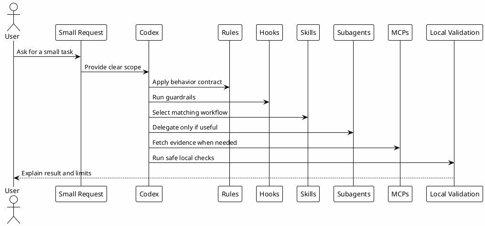

# 15 - Guided First Task

## In One Sentence

The guided first task turns setup into practical evidence: you observe Codex using context, rules, skills, subagents, hooks and MCPs on a small request.

## What You Will Understand

By the end of this page, you should move from "I installed files" to "I know how to observe whether the environment changed the workflow".

## Summary

The goal is not a large delivery. The goal is to execute a small, safe and verifiable task.

It should not require deploys, PRs, Slack, Jira, production or sensitive data.

## Before You Start

Choose a repository or study folder where read-only inspection is safe.

Do not use a task that requires:

- production changes;
- push;
- PR creation;
- external messages;
- secrets;
- migrations;
- publishing the playbook.

## Diagram



## Task 1 - Read-only Orientation

Ask Codex inside a local project:

```text
Help me understand this project. First read only orientation files, scripts and folder structure. Then explain what stack seems to be used, which validation commands exist and which files I should read before changing code.
```

Expected result:

- Codex starts with local reads, not assumptions;
- commands have controlled output;
- install, lint, test or build scripts are identified when present;
- limits are stated;
- no files are changed.

## Task 2 - Small Investigation

Ask:

```text
Help me investigate where this project defines local validation commands. Bring evidence from the files read and say which command I should run first.
```

## Task 3 - Local Validation

If the project has clear scripts, run one small command:

```bash
rtk npm run lint
```

or:

```bash
rtk npm test
```

Use the real command indicated by the project. If it is not Node.js, adapt to the local stack.

## Task 4 - Memory Or Knowledge

If the investigation reveals a useful decision, ask:

```text
Does this create reusable learning? If yes, say where it should be saved: Session-Memory, gotcha, runbook, skill or project documentation.
```

## Final Checklist

You completed the journey when you can answer:

- which files in `~/.codex` control local behavior;
- which skill or subagent fits each type of request;
- which hook protects commands before execution;
- when to use MCP or vault for evidence;
- how to validate setup without publishing anything;
- where to save reusable learning;
- when to ask for approval before an external action.

## Common Mistakes In The First Use

- Asking for a task that is too large right after setup.
- Not filling template variables before downloading files.
- Running validation without knowing the project stack.
- Confusing a local dependency failure with a Codex failure.
- Saving secrets in memory, docs or templates.
- Expecting subagents to be used for every simple question.

## Closing

After this step, the environment can be used on a small real task. Pick a read-only investigation or a low-risk local improvement and observe which layers enter the workflow.
